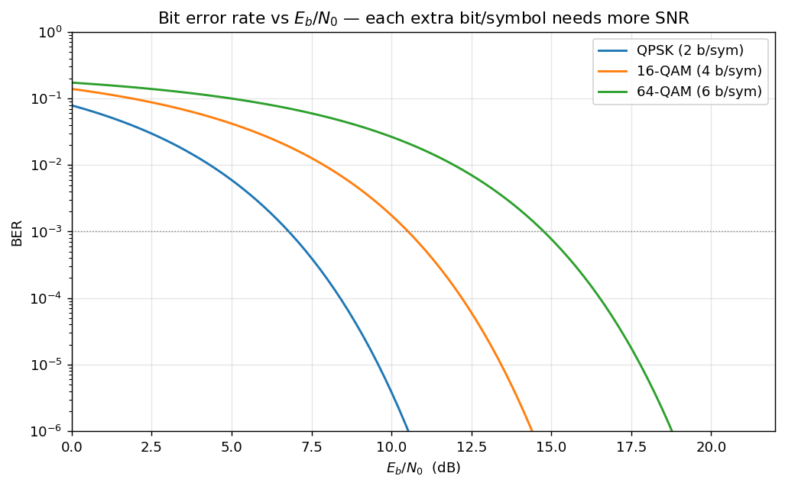
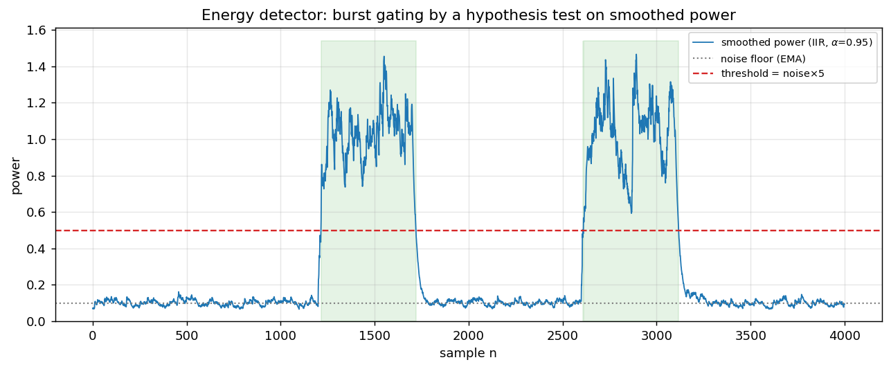

# USRP B210 SDR Link — System Reference

End-to-end digital communication system for two USRP B210 radios (UHD), written in C++.
This document lists **every feature, algorithm (with the math and the common alternatives),
and command-line option** exposed by `sdr_system`.

- Binary: `build/sdr_system`
- Help: `./sdr_system --help`
- Two operating styles: **one-way** (`--role tx` / `--role rx`, repeated sends, auto-terminating RX)
  and **ARQ** (`--role source_arq` / `--role sink_arq`, stop-and-wait with ACK).

---

## 1. Signal-chain overview

```
TX:  message ─► split into chunks ─► CRC-16 ─► [FEC encode] ─► bits→symbols (modulator)
        ├── single-carrier: RRC pulse-shape ─► preamble prepend ─► USRP TX
        └── OFDM:            QAM→IFFT+CP frame [SC-sync | chan-est | data] ─► USRP TX

RX:  USRP RX ─► energy detector (burst gate) ─► AGC ─► frame/symbol sync
        ├── single-carrier: matched filter ─► timing (Gardner) ─► [equalizer] ─► demod
        └── OFDM:            Schmidl-Cox sync + CFO ─► FFT ─► 1-tap eq ─► pilot CPE ─► demod
     ─► [FEC decode] ─► CRC-16 check ─► (ARQ: ACK if OK) ─► reassemble message
```

Default physical parameters: symbol rate `0.8 MHz`, `U/D = 2/1` → sample rate `1.6 MHz`
(integer **2 samples/symbol** on the wire), RRC roll-off `0.25`, 151 taps.

---

## 2. Modulation

`--scheme <NAME>` selects the constellation. Supported (bits/symbol in parentheses):

| Family | Schemes | bits/sym |
|---|---|---|
| PSK | `BPSK` (1), `QPSK` (2), `8-PSK` (3) | 1–3 |
| QAM | `16-QAM` (4), `32-QAM` (5), `64-QAM` (6), `128-QAM` (7), `256-QAM` (8) | 4–8 |
| Differential | `DBPSK` (1), `DQPSK` (2), `8-DPSK` (3), `PI4-QPSK` (2) | 1–3 |
| APSK | `16APSK` (4), `32APSK` (5) | 4–5 |

(`16QAM` and `16-QAM` spellings both accepted.)

**Math.** A modulator maps $k=\log_2 M$ bits to one of $M$ complex points $s = I + jQ$:

- **M-PSK**: points on the unit circle, $s = e^{\,j2\pi m/M}$, $m=0,\dots,M-1$. All symbols
  equal-energy; demod by nearest angle. Robust but spectrally inefficient at high order (points
  crowd on the circle).
- **M-QAM**: square/cross grid of amplitudes, $s = (2i-\sqrt{M}+1) + j\,(2q-\sqrt{M}+1)$. Best
  power efficiency for a given rate on an AWGN channel, but needs accurate amplitude →
  sensitive to gain/EVM/clipping (this is why 16-QAM failed OTA at ~20 % EVM while QPSK
  survived ~37 %).
- **APSK**: points on a few concentric rings. Lower PAPR than QAM, favored on non-linear
  (satellite) amplifiers — a middle ground between PSK and QAM.
- **Differential (D\*)**: information is in the **phase change** between consecutive symbols,
  $s_n = s_{n-1}\,e^{\,j\Delta\varphi}$. No absolute phase reference needed → tolerates carrier
  phase offset / no PLL, at a ~3 dB SNR penalty. `PI4-QPSK` rotates the constellation by
  $\pi/4$ each symbol to avoid zero-crossings (lower envelope variation).

**Detection & why constellation order costs SNR.** The demodulator makes a **minimum-distance
decision** — pick the constellation point nearest the received symbol $y$ (optimal for
equiprobable symbols in AWGN):

$$ \hat{s} = \arg\min_{c\,\in\,\mathcal{C}} \; |\,y - c\,| $$

An error occurs when noise/distortion pushes $y$ past the halfway line to a neighbour, i.e.
beyond half the **minimum distance** $d_{\min}/2$. For a fixed average power $E_s$, packing more
points shrinks $d_{\min}$: QPSK has $d_{\min}=\sqrt{2E_s}$ with the whole plane split into 4
quadrants, while 16-QAM squeezes 16 points into the same power so $d_{\min}$ is ~3× smaller and
its decision cells ~3× tighter. The **error vector magnitude**

$$ \mathrm{EVM} = \frac{\mathrm{rms}(\,y-\hat{s}\,)}{\mathrm{rms}(c)} $$

measures how far symbols land from ideal; reliable decoding needs roughly
$\mathrm{EVM} \lesssim d_{\min}/(2\,\mathrm{rms})$, which is why QPSK survived ~37 % EVM over the
air but 16-QAM (needing $\lesssim 12\%$) did not. **Gray coding** the bit→point map (adjacent
points differ by one bit) makes each symbol error cost only ~1 bit error.




**Bits↔symbols detail.** Gray-like index mapping; `bits_to_index` zero-fills a partial final
group so schemes whose bits/symbol don't divide the frame (32-QAM, 128-QAM) still align — a
bug fixed early in this project.

**Common alternatives not implemented:** GMSK/CPM (constant-envelope, used in GSM/Bluetooth),
non-square 8-QAM, probabilistic constellation shaping.

---

## 3. Waveform: single-carrier vs OFDM

`--waveform sc` (default) or `--waveform ofdm`.

### 3.1 Single-carrier + RRC pulse shaping
Symbols are upsampled `U/D` and convolved with a **root-raised-cosine** filter
(`--filter_type rrc`, `--roll_off 0.25`, `--num_taps 151`).

**Math.** A raised-cosine (RC) spectrum satisfies the **Nyquist ISI criterion** — its impulse
response is zero at every other symbol instant, $g(mT)=\delta[m]$ — so neighbouring symbols don't
interfere at the sampling times. Splitting it as **RRC at TX and RRC at RX** makes the cascade
$G_{RRC}(f)\,G_{RRC}(f)=G_{RC}(f)$ a full RC (matched-filter optimal in AWGN) *and* maximizes SNR.
The roll-off $\beta \in [0,1]$ trades occupied bandwidth against sidelobe decay:

$$ B = (1+\beta)\,\frac{R_{sym}}{2}\quad\text{(one-sided baseband; occupied width }=(1+\beta)R_{sym}). $$

Alternatives: `rc` (raised cosine, all shaping at TX), `lp` (plain low-pass); Gaussian shaping
(GMSK) is the common constant-envelope alternative.


### 3.2 OFDM
Frame layout per burst: `[ Schmidl-Cox sync symbol | channel-estimation symbol | data symbols… ]`,
each symbol = `N`-point IFFT + cyclic prefix.

- `--ofdm-fft 64` — number of subcarriers `N` (FFT size).
- `--ofdm-cp 16` — cyclic-prefix length (must exceed the channel's delay spread).
- `--ofdm-tx-peak 0.5` — scales the frame so its peak ≈ this value (OFDM has high PAPR;
  keep the DAC out of clipping).

**Math.** OFDM splits the band into $N$ narrow orthogonal subcarriers via the inverse DFT:

$$ x[n] = \frac{1}{N}\sum_{k=0}^{N-1} X[k]\,e^{\,j2\pi kn/N}. $$

A cyclic prefix (copy of the tail prepended) turns the channel's *linear* convolution into
*circular* convolution, so after the FFT each subcarrier sees a single complex gain $H[k]$:

$$ Y[k] = H[k]\,X[k] + W[k]. $$

Equalization is then **one complex divide per subcarrier**, $\hat{X}[k] = Y[k]/H[k]$ — no FIR
equalizer needed even under heavy multipath, provided the delay spread < CP. This is why OFDM is
preferred for dense QAM on frequency-selective channels. Cost: high peak-to-average power ratio
(PAPR) and sensitivity
to carrier frequency offset (loss of subcarrier orthogonality → inter-carrier interference).


**Channel estimation & pilots.** One known **channel-estimation symbol** (known value on every
active subcarrier) gives $H[k] = Y_\text{chest}[k]/\text{ref}[k]$. **Scattered pilots** (every 8th active
subcarrier carries a known value) then track the residual **common phase error (CPE)** that
grows symbol-by-symbol from residual CFO.

**CPE estimation — the fix that made OFDM work OTA.** Per data symbol, estimate the phase φ
from the pilots and derotate:

$$ \hat{\varphi} = \arg\!\Big( \sum_{k\,\in\,\text{pilots}} Y[k]\,H^{*}[k]\,\text{PILOT}^{*} \Big)
   \qquad\text{(maximum-ratio combining)} $$

The earlier version used the *equalized* pilot $Y[k]/H[k]$, which **blows up on a deep-fade
subcarrier** (tiny |H[k]|) — one garbage pilot then hijacked φ and smeared the whole symbol
into a blob (EVM ~67%, 0 CRC over the air; invisible in a mild simulation channel). Weighting
by channel power `|H[k]|²` via `Y·conj(H)` suppresses faded pilots instead of amplifying them
→ four clean clusters (EVM ~37%), message decodes. Disable with env `OFDM_NO_CPE=1` to compare.

**Common alternatives:** decision-feedback / per-subcarrier phase-locked tracking, MMSE channel
estimation (vs the least-squares one used here), pilot-aided residual-CFO (SFO) slope correction,
windowed-OFDM / filtered-OFDM / OTFS for spectral containment.

---

## 4. Energy detection (burst gating)

The RX runs continuously; the energy detector decides *when a burst is present* so downstream
sync isn't run on noise.

**Math.** This is a **binary hypothesis test** per sample — $H_0$: noise only, $H_1$: signal
present — on the received power. The instantaneous power $|r[n]|^2$ is smoothed by a one-pole IIR
(exponential moving average) to reduce variance:

$$ P[n] = (1-\alpha)\,|r[n]|^2 + \alpha\,P[n-1], \qquad \text{declare burst if } P[n] > \gamma. $$

Larger $\alpha$ = more averaging (time constant $\approx 1/(1-\alpha)\approx 20$ samples), which
trades detection latency for a lower false-alarm rate — the smoothing collapses the variance of
the noise-power estimate so a single threshold $\gamma$ cleanly separates the two hypotheses.
($\alpha=0.02$ barely smoothed → the detector fired on every noise spike and even chopped real
bursts apart on the RRC envelope; $\alpha=0.95$ gives one clean capture/burst.)

- **Adaptive threshold** (`--det-adaptive true`, default): $\gamma = \nu \cdot \hat{N}_0$ where
  $\hat{N}_0$ is the measured noise floor and $\nu$ = `--det-mult 5` (raise to 10–30 over the air
  so ambient RF doesn't trigger it; too high misses weak bursts).
- **Continuous noise tracking** (`--det-continuous true`, default): the noise floor itself is
  re-estimated by an EMA during idle periods, $\hat{N}_0 \leftarrow (1-\beta)\hat{N}_0 + \beta\,|r[n]|^2$,
  so it follows drifting ambient noise. Alternative: one-shot startup calibration
  (`--det-continuous false`) — simpler but brittle if the environment changes.
- **Fixed threshold** (`--det-adaptive false` + `--det-threshold 1e-7`): absolute cutoff, only for
  a known clean cabled link.
- `--energy_packet_size` — how many samples to grab once a burst is detected (auto-sized per
  modulation).



**Common alternatives:** matched-filter / correlation detection (detect on the *known preamble*
rather than energy — more sensitive but needs the template), constant-false-alarm-rate (CFAR)
detectors, cyclostationary feature detection (works below the noise floor).

---

## 5. Synchronization, frequency & phase offset

### 5.0 The received-signal model (what every block below is undoing)

After the RX front-end down-converts to baseband, the transmitted symbol stream `s[m]`
(pulse-shaped, sampled at `fs`) arrives distorted by four separable impairments:

$$ r[n] = \underbrace{A\;e^{\,j\left(2\pi\frac{\Delta f}{f_s} n + \varphi_0\right)}}_{\text{carrier}}
   \underbrace{\sum_m s[m]\,g\!\left(nT_s - mT - \tau\right)}_{\text{timing (delay }\tau)}
   \;+\; \underbrace{w[n]}_{\text{noise}} $$

- $A$ — unknown gain → removed by the **AGC** (§9).
- $\Delta f$ — **carrier frequency offset (CFO)**: the two radios' oscillators differ (each B210
  TCXO is ±2 ppm, so up to ~4 ppm ≈ 3.6 kHz at 915 MHz). A constant $\Delta f$ produces a phase
  that **grows linearly with time**, $\theta[n] = 2\pi(\Delta f/f_s)\,n$ — it *spins* the
  constellation. Left uncorrected it turns the constellation into a ring.
- $\varphi_0$ — **static carrier phase offset**: the oscillators' phase difference at acquisition
  plus the channel's phase. A constant *rotation* of the whole constellation.
- $\tau$ — **timing offset**: the ADC sampling grid isn't aligned to the symbol centers, so the
  matched filter is sampled off its peak → inter-symbol interference (ISI).
- $w[n]$ — AWGN.

Note the coupling: **residual CFO becomes a phase ramp** $\varphi[n] = \varphi_0 + 2\pi(\Delta f/f_s)\,n$, which is
why §5.5 uses a *second-order* loop (tracks a constant phase **and** its constant rate) and why
OFDM needs per-symbol CPE tracking (§3.2). The recovery order is:
**frame sync → timing → CFO → phase**.

### 5.1 Preamble (the known reference all estimators key off)
`--preamble m-sequence` (default) or `--preamble zadoff`; `--m 5` sets the m-sequence order
(length `L = 2^m − 1 = 31`).

A good preamble $p$ has a **thumbtack autocorrelation**
$\sum_n p[n]\,p^{*}[n+k] \approx E\,\delta[k]$ (large at zero lag, near-zero elsewhere) so the
correlator (§5.2) gives one sharp, unambiguous peak.

- **m-sequence** — maximal-length binary (BPSK ±1) shift-register sequence. Periodic
  autocorrelation is two-valued: $L$ at zero lag, $-1$ otherwise. Real-valued.
- **Zadoff-Chu** — complex **CAZAC** sequence $p[n] = e^{-j\pi u\, n(n+1)/L}$: *constant amplitude*
  and *zero cyclic autocorrelation*. The flat spectrum makes it ideal for training a complex
  channel estimate / equalizer, and its constant envelope correlates cleanly even under CFO.
  Preferred for equalizer training and dense QAM.

For **differential** schemes the **last preamble symbol doubles as the differential reference**:
the TX encodes the first data symbol relative to it, and the RX keeps that one symbol in front of
the data so the differential decoder returns exactly $N$ symbols (not $N-1$). This keeps the
decoded bit count aligned with the fixed FEC/CRC/ARQ framing, and these schemes bypass the
coherent phase PLL (§5.5) — a decision-directed loop would pin the absolute phase and destroy the
transitions they carry. (The equalizer path prepends the *ideal* `preamble.back()` instead, since
equalization has already normalized the data to the ideal frame.) Hardware-verified end-to-end for
DBPSK / DQPSK / 8-DPSK; without this the reference off-by-one shifted the framing and every packet
failed even though sync was perfect.

### 5.2 Frame synchronization — ACQ correlation
The receiver must find where the packet starts. `ACQSynchronizer::SamplesACQPerformance`
slides the known preamble over the burst and computes, at each candidate offset τ (the
`ComputeCorrelation` routine), the **matched-filter / cross-correlation** magnitude:

$$ R(\tau) = \left| \sum_{n=0}^{L-1} p^{*}[n]\; r[\,\tau + n\,o_s\,] \right|
   \qquad (o_s = \text{samples/symbol}) $$

By the matched-filter theorem this is the optimal detector for a known sequence in AWGN.
At the true start $\tau^{*}$, all $L$ terms add coherently → $R(\tau^{*}) \approx \sum|p[n]|^2$;
at any wrong offset the terms add with random phases → $R \sim \sqrt{L}$ (much smaller). Detection:

- **Coarse pass**: find $\tau$ where $R(\tau)$ first crosses `--sync_threshold` (default 15), then
- **Fine pass**: search ±a few samples around it for the true maximum.
- **Noise floor / CFAR**: `EstimateNoiseFloor` correlates *away* from the peak (excluding a guard
  zone) to measure the off-peak floor, so the threshold can be set relative to it. Set
  `--sync-threshold` below the real peak (≈ preamble length ~31 after AGC) but above that floor;
  watch the `[ACQ] Peak correlation` log lines.

Because the search tests **every sample** (not every `os`-th), the peak location simultaneously
gives **coarse symbol timing** — the correct sub-symbol sampling phase. (Striding by `os` would
test only one of the `os` phases and could lock a half-symbol off → catastrophic ISI, BER ≈ 0.5.
This was an actual bug; the brute-force search fixed it.)

### 5.3 Symbol-timing recovery — Gardner TED
The ACQ peak gets timing right to the nearest sample; the **Gardner timing-error detector**
(`GardnerTED`) then tracks the residual *fractional* delay continuously.
`--timing_loop_bw 0.015` (loop bandwidth `Bn·T`), `--timing_damping 0.707`, `--sps_sync 5`.

**Error detector.** With two samples per symbol — one at the symbol center $y_k$ and one at the
half-symbol midpoint $y_{k-1/2}$ — the Gardner error is

$$ e_k = \mathrm{Re}\!\left\{\, (y_k - y_{k-1})\; y_{k-1/2}^{*} \,\right\}. $$

Intuition: if sampling is early or late, the midpoint sample $y_{k-1/2}$ (sitting on the
transition between symbols) correlates with the slope $y_k - y_{k-1}$; at perfect timing the
midpoint is a true zero-crossing and $e_k = 0$. It is **decision-independent and
carrier-phase-independent** (the $\mathrm{Re}\{\cdot\}$ with the difference term cancels a
constant rotation), so it works *before* CFO/phase are resolved — the reason Gardner is the
default choice for QAM.


**Loop.** The NCO advances $\omega = 2/\text{sps}$ per input sample (two strobes/symbol — using
$1/\text{sps}$ gives only one strobe and the "midpoint" lands a full symbol away → the loop tracks
garbage; this was a fixed bug). A **Farrow interpolator** produces the fractional-delay sample at
offset $\mu$, and a **proportional-integral (PI) loop filter** drives $\mu$:

$$ \nu \mathrel{+}= K_2\, e_k \quad(\text{integrator — tracks a constant timing rate / clock offset}),
   \qquad \mu \mathrel{-}= K_1\, e_k \quad(\text{proportional}). $$

with $\nu$ clamped to ±10 % of $\omega$. The PI coefficients come from the standard second-order
design (same $\theta_n$/$\zeta$ formulas as §5.5). Only the symbol-center strobes are emitted →
exactly one sample per symbol out.

*Alternatives:* Mueller & Müller (decision-directed, needs only 1 sample/sym but needs carrier
first), early-late gate, zero-crossing TED.

### 5.4 Carrier frequency offset (CFO) estimation & correction
A constant CFO spins the constellation at $2\pi\,\Delta f/f_s$ rad/sample. Two estimators are
provided (`CFOEstimator`), both **data-aided** off the preamble, then `FrequencyShifter` removes
it by multiplying sample $n$ by $e^{-j2\pi(\Delta f/f_s)n}$ (a running phase accumulator, so
blocks join seamlessly).

![A residual CFO makes the phase ramp $\varphi[n]=2\pi(\Delta f/f_s)n$ — the constellation smears from clean clusters into arcs and finally a full ring (exactly the failure mode seen with uncorrected OFDM over the air).](figures/cfo_effect.png)

**(A) Pilot-aided (phase-slope across preamble symbols).** For preamble symbols $p[k]$ received at
$r[k\cdot\text{sps}]$, the phase advance per symbol is measured with the known data stripped off:

$$ \varphi_k = \arg\!\big(\, r[k\,\text{sps}]\; r^{*}[(k{-}1)\text{sps}]\; p^{*}[k]\; p[k{-}1] \,\big),
   \qquad \widehat{\Delta f} = \frac{f_s}{2\pi\,\text{sps}}\;\overline{\varphi_k}. $$

Averaging over the preamble reduces noise. Unambiguous range $|\Delta f| < f_s/(2\,\text{sps})$
(one symbol of phase must not wrap).

**(B) Auto-correlation (Moose / Schmidl-Cox).** With a preamble made of two identical halves of
length $L$, the second half equals the first times the CFO phase accrued over $L$ samples:

$$ P = \sum_{n=0}^{L-1} r[n]\; r^{*}[n+L] \;\approx\; |A|^2 L\; e^{\,j2\pi(\Delta f/f_s)L},
   \qquad \widehat{\Delta f} = \frac{f_s}{2\pi L}\,\arg(P). $$

Unambiguous range $|\Delta f| < f_s/(2L)$ — smaller $L$ → wider capture range but noisier. This is
the same estimator OFDM uses (§5.6), where $L = N/2$.

**Why residual CFO still matters.** $\arg(\cdot)$ limits the estimate; whatever is left is a slow
phase ramp the **phase tracker (§5.5)** or **OFDM pilot CPE (§3.2)** cleans up. Getting this
balance wrong is exactly what smeared 16-QAM/OFDM over the air.

### 5.5 Carrier phase offset — estimation & PLL tracking
After timing + CFO the symbols still carry a residual phase $\varphi[n] = \varphi_0 + (\text{residual ramp})$.
For **absolute** constellations (BPSK/QPSK/QAM) all of it must be removed before hard decisions;
for **differential** schemes the static $\varphi_0$ cancels automatically (demod uses phase
*differences*).

**One-shot estimators** (`PhaseOffsetEstimator`):

- **ML / preamble correlation** — optimal given the known preamble:
  $\hat{\varphi} = \arg\!\big(\sum_n r[n]\,p^{*}[n]\big)$.
- **M-th power (blind, for M-PSK)** — raising to the $M$-th power collapses all $M$ data phases
  onto one, removing the modulation: $\hat{\varphi} = \tfrac{1}{M}\arg\!\big(\sum_n r[n]^{M}\big)$.
- **Decision-directed** — $\hat{\varphi} = \arg\!\big(\sum_n r[n]\,\hat{s}^{*}[n]\big)$ against the
  nearest constellation points $\hat{s}$ (used for QAM, after a coarse lock).

**Tracking PLL** (`PhaseTracker`) — a second-order digital PLL that follows a static offset **and**
a constant frequency ramp (residual CFO). Per symbol: form the phase error against the nearest
decision, then update an integrator (frequency) and the phase:

$$
\begin{aligned}
e[n] &= \arg\!\big(\, \text{corrected}[n]\;\hat{s}^{*}[n] \,\big) &&\text{(phase detector, angle in }[-\pi,\pi]) \\
\text{freq} &\mathrel{+}= \beta\, e[n] &&\text{(integrator — tracks the residual CFO ramp)} \\
\varphi &\mathrel{+}= \alpha\, e[n] + \text{freq} &&\text{(NCO phase)}
\end{aligned}
$$

The loop coefficients come from the standard proportional-integral design for loop bandwidth
$B_n T$ (`--phase_loop_bw 0.02`) and damping $\zeta$ (`--phase_damping 0.707`):

$$ \theta_n = \frac{B_n T}{\zeta + 1/(4\zeta)}, \qquad
   \alpha = \frac{4\zeta\,\theta_n}{1 + 2\zeta\,\theta_n + \theta_n^{2}}, \qquad
   \beta  = \frac{4\,\theta_n^{2}}{1 + 2\zeta\,\theta_n + \theta_n^{2}}. $$

($\beta = 0$ gives a first-order loop.) Smaller $B_n T$ = less jitter but slower pull-in;
$\zeta = 0.707$ is the critically-damped standard.


*Alternatives:* Costas loop (joint carrier recovery on the raw samples), block Viterbi-Viterbi
phase estimation, pilot-symbol-aided interpolation.

### 5.6 OFDM synchronization — Schmidl & Cox
OFDM recovers frame timing and CFO jointly from a sync symbol built as two identical time halves
`[A A]` (generated by loading only the **even** subcarriers). Sliding a window of length `N/2`:

$$
\begin{aligned}
P(d) &= \sum_{n=0}^{N/2-1} r[d+n]\; r^{*}[d+n+N/2] &&\text{(half-to-half correlation)} \\
R(d) &= \sum_{n=0}^{N/2-1} \big|\,r[d+n+N/2]\,\big|^{2} &&\text{(energy normaliser)} \\
M(d) &= |P(d)|^{2} / R(d)^{2} &&\text{(timing metric} \in [0,1])
\end{aligned}
$$

$M(d)$ forms a **plateau** where the two halves align; the frame start is the plateau's left edge
plus a small guard into the CP (any offset inside the CP is just a per-subcarrier phase the
channel estimate absorbs). The **fractional CFO** falls out of the same correlation:

$$ \hat{\epsilon} = \arg(P)\,/\,\pi \qquad \text{(subcarrier-spacing units, range } \pm 1 \text{ subcarrier)}. $$

and the burst is derotated by $e^{-j2\pi\epsilon n/N}$. Residual CFO / phase drift across the frame
is then tracked per symbol by the scattered-pilot CPE of §3.2. An energy gate ($R \ge 0.30\,\max R$)
stops the metric from locking onto the low-power noise pad before the burst.


*Alternatives:* Minn and Park metrics (sharper, no plateau ambiguity), CP-based blind sync.

---

## 6. Channel equalization (single-carrier)

`--eq_type None` (default) | `LMS` | `RLS` | `DFE`. `--eq_taps 11`, `--eq_mu 0.3` (NLMS step),
`--eq_dd false` (decision-directed tracking after training).

**Math.** A length-$T$ linear FIR equalizer $w$ estimates each symbol from a window of received
samples, $\hat{s}[k] = w^{H} r[k] = \sum_i w_i^{*}\, r[k-i]$, choosing $w$ to invert the channel
$h$ (ideally $w * h \approx \delta$). Two ways to find $w$:

- **Least-squares / MMSE training** (used, exact for the complex Zadoff-Chu preamble). Stack the
  preamble windows into a matrix $R$ and the known symbols into $s$; minimizing
  $\lVert Rw - s \rVert^{2}$ gives the normal equations

  $$ w = \big(R^{H} R + \lambda I\big)^{-1} R^{H} s $$

  solved here by Gaussian elimination. $\lambda I$ = Tikhonov / diagonal-loading regularization:
  it bounds noise enhancement at channel nulls (the MMSE, not zero-forcing, solution).

- **NLMS adaptive update** (real preamble / decision-directed tracking): step down the
  instantaneous-error gradient, normalized by input power for stability:

  $$ e[k] = s[k] - \hat{s}[k], \qquad
     w \leftarrow w + \mu\,\frac{e^{*}[k]\, r[k]}{\lVert r[k]\rVert^{2} + \varepsilon}
     \quad(\texttt{--eq\_mu}\ 0.3,\; 0 < \mu < 2). $$

The LS solution places the main tap at the equalizer center, so a **center-tap group delay** of
$(T-1)/2$ samples must be compensated when aligning the output — mishandling this looked like
"divergence" and was a fixed bug.

**Status / why default None.** On a clean cabled link no equalizer is needed. The LMS
decision-directed loop currently **diverges on the real hardware signal** (DD error grows and
destroys the symbols) — verified OTA where `None` decodes and `LMS` produces garbage. For
frequency-selective channels, prefer **OFDM** (§3.2), which equalizes per-subcarrier without an
adaptive FIR. Alternatives: DFE (feedback of past decisions, better on deep nulls),
RLS (faster convergence than LMS, O(n²) cost), MLSE/Viterbi equalization (optimal, expensive).

---

## 7. Forward error correction (FEC)

`--fec true` (default off) — rate-1/2, constraint-length-7 **convolutional code** with
**Viterbi** hard-decision decoding. Must match on both ends; halves the payload rate (2× symbols).

**Math.** Encoder: a 6-stage shift register holds the last $K-1 = 6$ input bits (state
$\sigma \in \{0,\dots,63\}$); each input bit $u$ emits two coded bits as mod-2 (XOR) taps of the
register per the generator polynomials $G_1 = 171_8$, $G_2 = 133_8$ (the standard NASA / 802.11a
code):

$$ c_1 = G_1 \cdot [u,\sigma] \bmod 2, \qquad c_2 = G_2 \cdot [u,\sigma] \bmod 2. $$

Each input bit thus influences $K = 7$ output-bit pairs (the constraint length / memory), which
is what lets the decoder recover it even when some of those bits are flipped.

**Viterbi decoding** finds the maximum-likelihood transmitted sequence by the most-likely path
through the 64-state trellis. For hard decisions the branch metric is the **Hamming distance**
between the received pair and each branch's expected $(c_1,c_2)$; the decoder keeps, per state,
the survivor path with the smallest cumulative metric:

$$ \text{PM}_t(\sigma') = \min_{\sigma \,\to\, \sigma'}
   \Big[\, \text{PM}_{t-1}(\sigma) + d_H\big(r_t,\; c(\sigma\!\to\!\sigma')\big) \,\Big] $$

then traces the survivors back to output the bits. It corrects any error pattern up to roughly
$\lfloor (d_\text{free}-1)/2 \rfloor$ — $d_\text{free} = 10$ for this code — per window; validated
~100 % CRC-OK up to ~2 % raw BER. (Two original bugs — encoder emitting from the *next* state,
traceback storing the bit instead of the predecessor state — were fixed.) **Soft-decision**
Viterbi (Euclidean instead of Hamming metric, using the raw symbol distances) would add ~2 dB but
isn't implemented.

**Common alternatives:** LDPC and Turbo codes (near-Shannon, used in Wi-Fi/5G), Reed-Solomon
(burst errors), Polar codes (5G control), soft-decision Viterbi (~2 dB better than the
hard-decision decoder here).

---

## 8. Error detection + ARQ

- **CRC-16-CCITT** appended to every chunk; the RX drops any chunk that fails the check
  (guarantees the delivered message is error-free).
- **Stop-and-wait ARQ** (`--role source_arq` / `sink_arq`): the source sends a chunk and waits
  for an ACK; on `--timeout 3000` ms it retransmits; it advances when ACKed and exits when all
  chunks are ACKed. The sink CRC-verifies each chunk, ACKs only verified ones, re-ACKs duplicates,
  and auto-stops once every chunk is in.
- **ACK transport** (`--ack-transport`):
  - `tcp` (default) — ACK over a socket; **no reverse RF path needed**. Source connects to
    `--ack-host 127.0.0.1 : --ack-port 5599` (the sink listens there). Ideal when both radios
    share one host.
  - `rf` — ACK sent back over the air on the second RF path (needs a clean reverse link).

**Math/theory.** Treat the message bits as coefficients of a polynomial $M(x)$ over GF(2); append
16 zeros ($M(x)\cdot x^{16}$) and divide by the CRC-16-CCITT generator
$G(x) = x^{16}+x^{12}+x^{5}+1$ (mod-2 / XOR long division). The 16-bit remainder is the CRC; the
RX recomputes it and flags any nonzero mismatch. Because an undetected error requires the error
polynomial $E(x)$ to be an exact multiple of $G(x)$, this structure guarantees detection of: all
single- and double-bit errors, any odd number of errors ($G$ has the factor $x+1$), and all burst
errors of length $\le 16$. Residual undetected probability $\approx 2^{-16}$ for random errors.

Stop-and-wait is the simplest ARQ (throughput limited by idling one round-trip per chunk).
*Alternatives:* Go-Back-N / Selective-Repeat (pipelined, higher throughput), Hybrid-ARQ
(FEC + ARQ combined — what you get here with `--fec` on: FEC corrects most errors, CRC+retransmit
catches the rest).

**One-way mode** (`--role tx` / `rx`, no ACK): the TX cycles all chunks `--tx-reps` times; the RX
reassembles from CRC-verified chunks and auto-stops `--rx-idle-timeout 8` s after the last burst.

---

## 9. Automatic gain control (AGC)

`--AGC_type Feed` (feed-forward, default) or `Closed` (closed-loop). Feed-forward measures the
detected burst's RMS and scales it to unit power in one shot (no loop lag); closed-loop adapts a
gain over time. The energy detector's captured burst feeds the AGC before sync.

---

## 10. Visualization / EVM

`--viz true` (default) captures one TX and one RX burst and **auto-saves a figure on exit** to
`<viz-dir>/<scheme>/figure.png` (per-modulation folder, `--viz-dir viz`). The 2×3 figure shows
TX/RX **time domain**, **spectrum** (FFT), and **constellation** with the ideal points overlaid
and an **EVM %** readout. Rough EVM ceilings for reliable decode: QPSK tolerates ~30–35% (more
with FEC), 16-QAM needs <~12%, 64-QAM <~6%. Render manually with
`python3 tools/plot_viz.py <dir> --fs 1.6e6 --save out.png`.

---

## 11. Complete command-line reference

### Mode / roles
| Option | Default | Controls |
|---|---|---|
| `--role` | `both` | `tx`, `rx`, `both`, `source_arq`, `sink_arq` |
| `--mode` | `source` | legacy source/sink selector |
| `--tx-reps` | `20` | one-way: times to cycle all chunks (no ACK) |
| `--rx-idle-timeout` | `8.0` | one-way RX: auto-stop after N s of no bursts (0 = until Ctrl-C) |
| `--num_bits` | `1000` | payload bits per packet |
| `--interval` | `3000` | TX gap between packets (ms) |

### ARQ / ACK
| Option | Default | Controls |
|---|---|---|
| `--ack-transport` | `tcp` | ACK channel: `tcp` or `rf` |
| `--ack-host` | `127.0.0.1` | TCP: sink IP the source connects to |
| `--ack-port` | `5599` | TCP: ACK socket port |
| `--timeout` | `3000` | source ACK timeout (ms) before retransmit |
| `--timer_interval` | `1000` | sink ACK timer interval (ms) |

### Modulation / waveform / FEC
| Option | Default | Controls |
|---|---|---|
| `--scheme` | `QPSK` | constellation (§2) |
| `--fec` | `false` | rate-1/2 K=7 conv + Viterbi (must match both ends) |
| `--waveform` | `sc` | `sc` (single-carrier) or `ofdm` |
| `--ofdm-fft` | `64` | OFDM subcarrier count (FFT size) |
| `--ofdm-cp` | `16` | OFDM cyclic-prefix length |
| `--ofdm-tx-peak` | `0.5` | OFDM peak scaling (PAPR / clipping guard) |
| `--sps` | `2` | samples/symbol (informational) |

### Preamble / pulse shaping
| Option | Default | Controls |
|---|---|---|
| `--preamble` | `m-sequence` | `m-sequence` or `zadoff` |
| `--m` | `5` | m-sequence order (length 2^m−1) |
| `--add_preamble` | `true` | prepend preamble to each packet |
| `--filter_type` | `rrc` | `rrc` / `rc` / `lp` |
| `--roll_off` | `0.25` | RRC/RC roll-off β |
| `--num_taps` | `151` | filter tap count |
| `--U` / `--D` | `2` / `1` | pulse-shaper up/down sampling (wire sps = U/D) |
| `--symbol_rate` | `0.8e6` | symbol rate (Hz) |
| `--num_threads` | `1` | FFT threads |

### Energy detection
| Option | Default | Controls |
|---|---|---|
| `--alpha` | `0.95` | IIR power-smoothing (larger = smoother) |
| `--det-adaptive` (`--IIR_threshold_adaptive`) | `true` | use noise_floor×mult vs fixed threshold |
| `--det-mult` (`--IIR_threshold_multiplier`) | `5.0` | adaptive threshold multiplier (raise OTA to 10–30) |
| `--det-threshold` (`--energy_threshold`) | `1e-7` | fixed threshold (adaptive off only) |
| `--det-continuous` | `true` | re-track noise floor during idle vs one-shot calib |
| `--energy_packet_size` | `3300` | samples to collect after detection (auto-sized) |
| `--IIR_window_size` | `20` | IIR window size |

### Synchronization / timing / phase
| Option | Default | Controls |
|---|---|---|
| `--sync-threshold` (`--sync_threshold`) | `15.0` | ACQ correlation gate (set below true peak, above noise) |
| `--sps_sync` | `5` | samples/symbol at matched-filter output |
| `--recv_msg_len` | auto | data symbols to extract per burst (auto from scheme) |
| `--timing_loop_bw` | `0.015` | Gardner TED loop bandwidth BnT |
| `--timing_damping` | `0.707` | Gardner TED damping |
| `--phase_loop_bw` | `0.02` | carrier phase PLL bandwidth |
| `--phase_damping` | `0.707` | carrier phase PLL damping |

### Equalizer
| Option | Default | Controls |
|---|---|---|
| `--eq_type` | `None` | `None` / `LMS` / `RLS` / `DFE` (see §6 — LMS diverges OTA) |
| `--eq_taps` | `11` | equalizer tap count |
| `--eq_mu` | `0.3` | NLMS step (DD / real-preamble training) |
| `--eq_dd` | `false` | decision-directed tracking after LS training |

### RF hardware (TX)
| Option | Default | Controls |
|---|---|---|
| `--tx-args` | `""` | UHD TX device (e.g. `serial=30CD424`) |
| `--tx-rate` | `1.6e6` | TX sample rate (Hz) = symbol_rate·U/D |
| `--tx-freq` | `2.412e9` | TX centre frequency (Hz) |
| `--tx-gain` | `20` | TX gain (dB) |
| `--tx-bw` | `1.0e6` | TX analog bandwidth (Hz) |
| `--tx-ant` | `TX/RX` | TX antenna port |
| `--tx-subdev` | `A:A` | TX subdev spec |
| `--tx-channel` | `0` | TX channel index |

### RF hardware (RX)
| Option | Default | Controls |
|---|---|---|
| `--rx-args` | `""` | UHD RX device (e.g. `serial=30CD3F7`) |
| `--rx-rate` | `1.6e6` | RX sample rate (Hz), must equal TX rate |
| `--rx-freq` | `2.412e9` | RX centre frequency (Hz) |
| `--rx-gain` | `30` | RX gain (dB) — key for EVM/clipping (§ recipes) |
| `--rx-bw` | `1.0e6` | RX analog bandwidth (Hz) |
| `--rx-ant` | `RX2` | RX antenna port |
| `--rx-subdev` | `A:A` | RX subdev spec |
| `--rx-channel` | `0` | RX channel index |

### Common RF / buffering / misc
| Option | Default | Controls |
|---|---|---|
| `--ref` | `internal` | clock reference: `internal` / `external` / `mimo` |
| `--settling` | `0.2` | RF settling time (s) |
| `--uhd_timeout` | `1000` | UHD TX timeout (ms) |
| `--samps_per_buff` | `10000` | samples per UHD receive buffer |
| `--num_recv_request` | `0` | total samples to receive (0 = continuous) |
| `--AGC_type` | `Feed` | `Feed` (feed-forward) or `Closed` (closed-loop) |
| `--dc-block` | `false` | experimental RX DC-block high-pass (see §13) |
| `--tx-dc-i` / `--tx-dc-q` | `0` / `0` | manual TX LO-leakage null, normalized [−1,1] (§13) |
| `--skip-rate-check` | off | bypass startup rate-consistency check |
| `--viz` | `true` | capture + auto-save TX/RX figure on exit |
| `--viz-dir` | `viz` | base dir for figures (per-scheme subfolder made) |

---

## 12. Command reference — per scheme (915 MHz, VERT900 antennas)

Copy-paste **sink / source ARQ** pairs with gains tuned per scheme from over-the-air testing
(two B210s ~10 cm apart). All use stop-and-wait ARQ (TCP ACK on localhost) + FEC, and auto-save
plots to `viz/<scheme>/figure.png`. The same set stands alone in the repo as `COMMANDS.md`, which
also carries adapted (untested) command templates for the **N210 / X310 / X410** — only the device
args, subdev, antenna and gain range change; the DSP flags are identical, and a shared 10 MHz
reference (`--ref external`) on those platforms lifts the §13 dense-QAM limitation.

**Rig:** RX/sink serial `30CD3F7` (ant `RX2`), TX/source serial `30CD424` (ant `TX/RX`), both
subdev `A:A`. Common flags: `--rx-freq/--tx-freq 915e6`, `--rx-rate/--tx-rate 1.6e6`,
`--ack-transport tcp --ack-port 5599 --det-mult 3 --fec true`. **Start the sink (RX) first.**

### Tuned gains per scheme (and why they differ)

| Scheme | Waveform | `--rx-gain` | `--tx-gain` | extra | OTA status |
|---|---|---|---|---|---|
| BPSK   | sc   | 20 | 78 | — | very robust |
| QPSK   | sc   | 20 | 78 | — | solid (5/5) |
| 8-PSK  | sc   | 16 | 86 | — | usable — a few ARQ retransmits (EVM ~16 %) |
| DBPSK  | sc   | 20 | 78 | — | solid (5/5) |
| DQPSK  | sc   | 20 | 78 | — | solid (5/5) |
| 8-DPSK | sc   | 16 | 86 | — | usable — a few ARQ retransmits |
| BPSK   | ofdm | 22 | 80 | `--ofdm-tx-peak 0.5` | robust |
| QPSK   | ofdm | 22 | 85 | `--ofdm-tx-peak 0.5` | solid |

The pattern: **8-ary schemes need more TX power (86) and lower RX gain (16)** — a stronger signal
buys the SNR their tighter decision regions demand without overdriving the front end. The key
lever is **TX power, not RX gain** (raising TX 76→86 roughly halved 8-PSK EVM, 28 %→16 %).
Higher-order QAM (16-QAM+) is omitted — the ~10 cm OTA link floors at ~28–31 % EVM, too noisy;
those need the cabled link (below). Differential schemes run on the default `--eq_type None`;
**do not combine differential with OFDM** (its pilots already handle phase).

### Single-carrier (`--waveform sc`, default)

```bash
# QPSK — sc   (robust tier: also BPSK / DBPSK / DQPSK, same gains)
# RX / sink
./sdr_system --role sink_arq --rx-args serial=30CD3F7 --tx-args serial=30CD3F7 \
  --rx-subdev A:A --rx-ant RX2 --rx-freq 915e6 --rx-rate 1.6e6 --rx-gain 20 \
  --scheme QPSK --fec true --ack-transport tcp --ack-port 5599 --det-mult 3
# TX / source
./sdr_system --role source_arq --tx-args serial=30CD424 --rx-args serial=30CD424 \
  --tx-subdev A:A --tx-ant TX/RX --tx-freq 915e6 --tx-rate 1.6e6 --tx-gain 78 \
  --scheme QPSK --fec true --ack-transport tcp --ack-host 127.0.0.1 --ack-port 5599 --timeout 3000
```
For **BPSK / DBPSK / DQPSK** on single-carrier, use the identical commands with the scheme name
swapped (`--scheme BPSK` / `DBPSK` / `DQPSK`) — same 20 / 78 gains.

```bash
# 8-PSK — sc   (8-ary tier: also 8-DPSK, same gains — more TX, lower RX)
# RX / sink
./sdr_system --role sink_arq --rx-args serial=30CD3F7 --tx-args serial=30CD3F7 \
  --rx-subdev A:A --rx-ant RX2 --rx-freq 915e6 --rx-rate 1.6e6 --rx-gain 16 \
  --scheme 8-PSK --fec true --ack-transport tcp --ack-port 5599 --det-mult 3
# TX / source
./sdr_system --role source_arq --tx-args serial=30CD424 --rx-args serial=30CD424 \
  --tx-subdev A:A --tx-ant TX/RX --tx-freq 915e6 --tx-rate 1.6e6 --tx-gain 86 \
  --scheme 8-PSK --fec true --ack-transport tcp --ack-host 127.0.0.1 --ack-port 5599 --timeout 3000
```
For **8-DPSK**, same commands with `--scheme 8-DPSK`.

### OFDM (`--waveform ofdm`, 64 subcarriers, CP 16)

```bash
# QPSK — OFDM   (BPSK: same, --scheme BPSK, --tx-gain 80)
# RX / sink
./sdr_system --role sink_arq --rx-args serial=30CD3F7 --tx-args serial=30CD3F7 \
  --rx-subdev A:A --rx-ant RX2 --rx-freq 915e6 --rx-rate 1.6e6 --rx-gain 22 \
  --waveform ofdm --ofdm-fft 64 --ofdm-cp 16 --scheme QPSK --fec true \
  --ack-transport tcp --ack-port 5599 --det-mult 3
# TX / source
./sdr_system --role source_arq --tx-args serial=30CD424 --rx-args serial=30CD424 \
  --tx-subdev A:A --tx-ant TX/RX --tx-freq 915e6 --tx-rate 1.6e6 --tx-gain 85 \
  --waveform ofdm --ofdm-fft 64 --ofdm-cp 16 --ofdm-tx-peak 0.5 --scheme QPSK --fec true \
  --ack-transport tcp --ack-host 127.0.0.1 --ack-port 5599 --timeout 3000
```

**One-way (no ACK)** instead of ARQ: use `--role rx` / `--role tx --tx-reps 20` and drop the
`--ack-*` flags. Run from `build/` and prefix `./`.

### Level-tuning cheatsheet (the #1 cause of "nothing decodes")
- RX `Peak=` is **post-AGC PAPR**; ~1.2–1.4 is normal, *not* ADC clipping. Only lower `--rx-gain`
  if chunks never decode **and** the raw front end is saturated.
- No detections (`bursts=0`) → signal too weak: raise `--tx-gain` (or `--rx-gain`), or lower `--det-mult`.
- Detections but CRC always fails → check the constellation EVM in the figure; if the order is too
  high for the link SNR, drop a scheme or improve the link. **TX power** is the main EVM lever.
- Keep `--fec true` on marginal links; it closes the last few % of bit errors.

### Higher-order QAM (16-QAM and up)
A clean channel is necessary but **not sufficient** on this two-radio rig — see §13. Over the air
the ~28–31 % EVM floor blocks it; on a direct cable the SNR is excellent but a carrier-leakage /
free-running-clock problem blocks it too. **Dense QAM needs a shared reference clock.**

---

## 13. Known limitation — dense QAM needs a shared reference clock

**Validated ceiling on this rig: QPSK and 8-PSK** (both single-carrier and OFDM, over the air and
over a cable). **16-QAM and higher do not decode** on the two free-running B210s, and the cause is
understood.

### Symptom
Over a direct SMA cable the SNR is excellent — the QAM *amplitude* is perfect (clean concentric
rings at the right radii) and QPSK decodes — yet 16-QAM fails on **both** waveforms: single-carrier
shows a **phase-rotating ring**, OFDM a **blob at the origin**.

### Root cause
The two B210s run on **independent TCXOs** (no shared clock), so there is a real carrier frequency
offset whose estimate jitters ±1200 Hz. On the cable, the **TX carrier / LO leakage couples
straight into the RX** (a ~40 dB spike near DC) and **beats at that CFO** — a slowly drifting
near-DC tone. It (a) rotates the constellation, which QPSK's wide decision regions survive but
16-QAM's don't (and the decision-directed phase PLL can't lock 16 points), and (b) dominates the
AGC, collapsing the OFDM constellation.

### What we tried (and why each failed)
- **Static DC / per-burst mean removal** — the leakage is a *drifting tone*, not a static DC, so
  mean subtraction can't remove it.
- **RX DC-block high-pass** (`--dc-block`) — a gentle cutoff has no effect; an aggressive cutoff
  removes the leakage but **distorts the m-sequence preamble** (ACQ correlation peak 69→45) and
  breaks sync. Left in as an off-by-default option.
- **Manual TX LO-leakage null** (`--tx-dc-i` / `--tx-dc-q`, via `set_tx_dc_offset`) — only shifts
  the DC spike ~7 dB, and noisily, so the spike is mostly **RX self-mixing**, not TX feedthrough.
  The B210 can't self-calibrate either (no cal antenna → `uhd_cal_tx_dc_offset` fails).

### The fix
Feed a **common 10 MHz reference** into both radios' `REF IN` and run both with `--ref external`
(a signal generator's 10 MHz output split two ways, a GPSDO, or an OctoClock). That drives
**CFO ≈ 0** (no residual rotation → dense QAM decodes) *and* turns the leakage into a **true static
DC** (removed by the RX DC-offset correction / OFDM's nulled DC subcarrier). This is the standard
requirement for coherent operation between separate SDRs.

Without a shared clock, the alternative is dedicated DSP — most promisingly **OFDM with
leakage-robust sync** (AGC and CFO estimation that exclude the DC region; OFDM's scattered pilots
already track residual CFO the WiFi way) or **pilot-aided single-carrier** — a substantial effort
with no guarantee, versus a ~$100 reference clock that is guaranteed.

**Note:** WiFi radios are *also* free-running and still do 256-/1024-QAM — via per-packet
preamble CFO estimation + continuous pilot tracking (which we have) *and* factory-calibrated TX LO
leakage (which the B210, uncalibrated on a direct cable, lacks). Closing that gap is exactly the
DSP-vs-shared-clock trade-off above.
