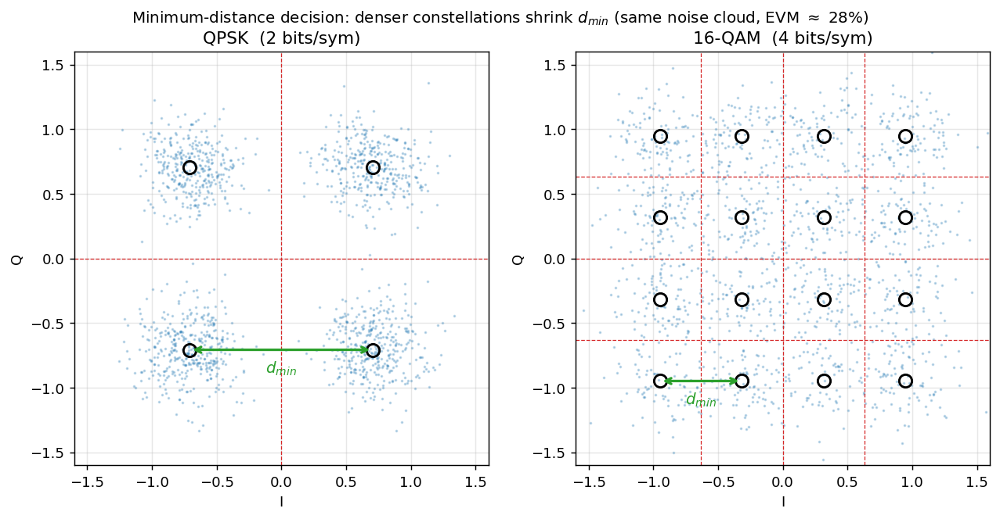
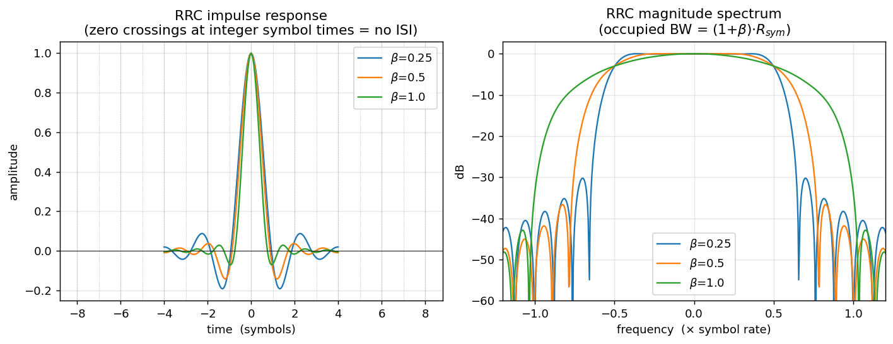
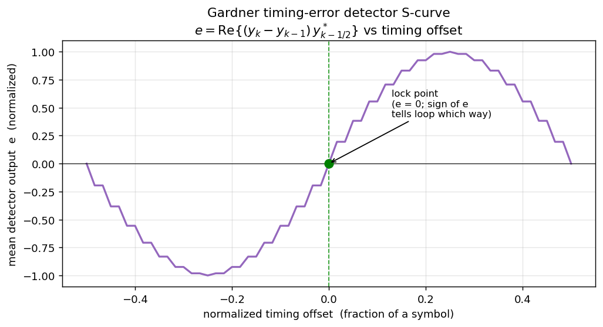
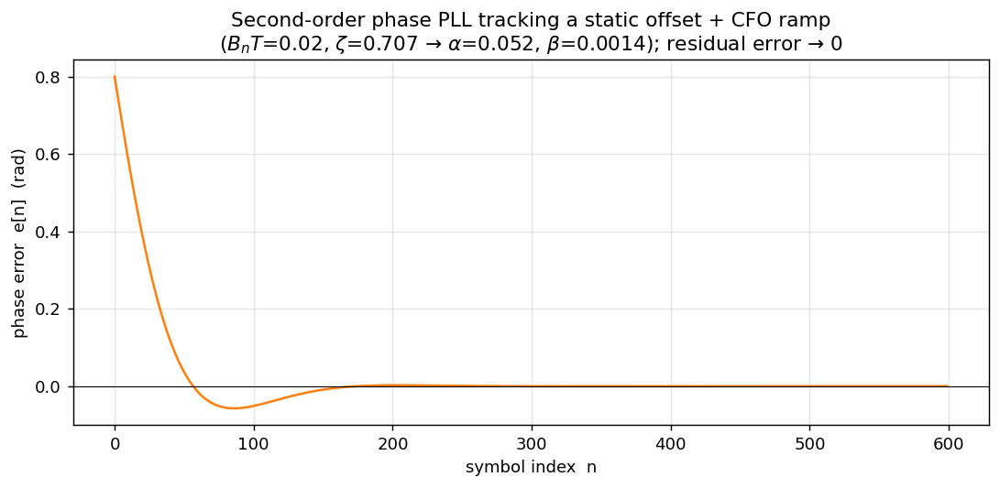
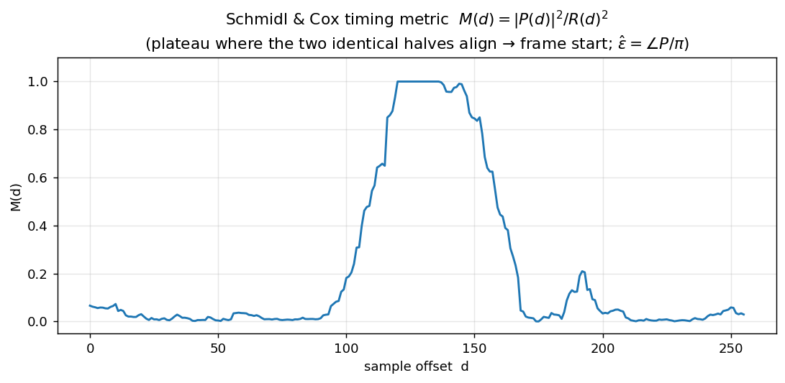

# USRP B210 SDR Link — System Reference

End-to-end digital communication system for two USRP B210 radios (UHD), written in C++.
This document lists **every feature, algorithm (with the math and the common alternatives),
and command-line option** exposed by `sdr_system`.

- Binary: `drivers/usrp/build/sdr_system`
- Help: `./sdr_system --help`
- Two operating styles: **one-way** (`--role tx` / `--role rx`, repeated sends, auto-terminating RX)
  and **ARQ** (`--role source_arq` / `--role sink_arq`, stop-and-wait with ACK).

---

## 1. Signal-chain overview

```
TX:  message ─► split into chunks ─► CRC-16 ─► [FEC encode] ─► bits→symbols (modulator)
        ├── single-carrier: RRC pulse-shape ─► preamble prepend ─► USRP TX
        └── OFDM:            QAM→IFFT+CP frame [SC-sync | chan-est | data] ─► USRP TX

RX:  USRP RX ─► energy detector (burst gate) ─► AGC ─► frame/symbol sync
        ├── single-carrier: matched filter ─► timing (Gardner) ─► [equalizer] ─► demod
        └── OFDM:            Schmidl-Cox sync + CFO ─► FFT ─► 1-tap eq ─► pilot CPE ─► demod
     ─► [FEC decode] ─► CRC-16 check ─► (ARQ: ACK if OK) ─► reassemble message
```

Default physical parameters: symbol rate `0.8 MHz`, `U/D = 2/1` → sample rate `1.6 MHz`
(integer **2 samples/symbol** on the wire), RRC roll-off `0.25`, 151 taps.

---

## 2. Modulation

`--scheme <NAME>` selects the constellation. Supported (bits/symbol in parentheses):

| Family | Schemes | bits/sym |
|---|---|---|
| PSK | `BPSK` (1), `QPSK` (2), `8-PSK` (3) | 1–3 |
| QAM | `16-QAM` (4), `32-QAM` (5), `64-QAM` (6), `128-QAM` (7), `256-QAM` (8) | 4–8 |
| Differential | `DBPSK` (1), `DQPSK` (2), `8-DPSK` (3), `PI4-QPSK` (2) | 1–3 |
| APSK | `16APSK` (4), `32APSK` (5) | 4–5 |

(`16QAM` and `16-QAM` spellings both accepted.)

**Math.** A modulator maps $k=\log_2 M$ bits to one of $M$ complex points $s = I + jQ$:

- **M-PSK**: points on the unit circle, $s = e^{\,j2\pi m/M}$, $m=0,\dots,M-1$. All symbols
  equal-energy; demod by nearest angle. Robust but spectrally inefficient at high order (points
  crowd on the circle).
- **M-QAM**: square/cross grid of amplitudes, $s = (2i-\sqrt{M}+1) + j\,(2q-\sqrt{M}+1)$. Best
  power efficiency for a given rate on an AWGN channel, but needs accurate amplitude →
  sensitive to gain/EVM/clipping (this is why 16-QAM failed OTA at ~20 % EVM while QPSK
  survived ~37 %).
- **APSK**: points on a few concentric rings. Lower PAPR than QAM, favored on non-linear
  (satellite) amplifiers — a middle ground between PSK and QAM.
- **Differential (D\*)**: information is in the **phase change** between consecutive symbols,
  $s_n = s_{n-1}\,e^{\,j\Delta\varphi}$. No absolute phase reference needed → tolerates carrier
  phase offset / no PLL, at a ~3 dB SNR penalty. `PI4-QPSK` rotates the constellation by
  $\pi/4$ each symbol to avoid zero-crossings (lower envelope variation).

**Detection & why constellation order costs SNR.** The demodulator makes a **minimum-distance
decision** — pick the constellation point nearest the received symbol $y$ (optimal for
equiprobable symbols in AWGN):

$$ \hat{s} = \arg\min_{c\,\in\,\mathcal{C}} \; |\,y - c\,| $$

An error occurs when noise/distortion pushes $y$ past the halfway line to a neighbour, i.e.
beyond half the **minimum distance** $d_{\min}/2$. For a fixed average power $E_s$, packing more
points shrinks $d_{\min}$: QPSK has $d_{\min}=\sqrt{2E_s}$ with the whole plane split into 4
quadrants, while 16-QAM squeezes 16 points into the same power so $d_{\min}$ is ~3× smaller and
its decision cells ~3× tighter. The **error vector magnitude**

$$ \mathrm{EVM} = \frac{\mathrm{rms}(\,y-\hat{s}\,)}{\mathrm{rms}(c)} $$

measures how far symbols land from ideal; reliable decoding needs roughly
$\mathrm{EVM} \lesssim d_{\min}/(2\,\mathrm{rms})$, which is why QPSK survived ~37 % EVM over the
air but 16-QAM (needing $\lesssim 12\%$) did not. **Gray coding** the bit→point map (adjacent
points differ by one bit) makes each symbol error cost only ~1 bit error.




**Bits↔symbols detail.** Gray-like index mapping; `bits_to_index` zero-fills a partial final
group so schemes whose bits/symbol don't divide the frame (32-QAM, 128-QAM) still align — a
bug fixed early in this project.

**Common alternatives not implemented:** GMSK/CPM (constant-envelope, used in GSM/Bluetooth),
non-square 8-QAM, probabilistic constellation shaping.

---

## 3. Waveform: single-carrier vs OFDM

`--waveform sc` (default) or `--waveform ofdm`.

### 3.1 Single-carrier + RRC pulse shaping
Symbols are upsampled `U/D` and convolved with a **root-raised-cosine** filter
(`--filter_type rrc`, `--roll_off 0.25`, `--num_taps 151`).

**Math.** A raised-cosine (RC) spectrum satisfies the **Nyquist ISI criterion** — its impulse
response is zero at every other symbol instant, $g(mT)=\delta[m]$ — so neighbouring symbols don't
interfere at the sampling times. Splitting it as **RRC at TX and RRC at RX** makes the cascade
$G_{RRC}(f)\,G_{RRC}(f)=G_{RC}(f)$ a full RC (matched-filter optimal in AWGN) *and* maximizes SNR.
The roll-off $\beta \in [0,1]$ trades occupied bandwidth against sidelobe decay:

$$ B = (1+\beta)\,\frac{R_{sym}}{2}\quad\text{(one-sided baseband; occupied width }=(1+\beta)R_{sym}). $$

Alternatives: `rc` (raised cosine, all shaping at TX), `lp` (plain low-pass); Gaussian shaping
(GMSK) is the common constant-envelope alternative.



### 3.2 OFDM
Frame layout per burst: `[ Schmidl-Cox sync symbol | channel-estimation symbol | data symbols… ]`,
each symbol = `N`-point IFFT + cyclic prefix.

- `--ofdm-fft 64` — number of subcarriers `N` (FFT size).
- `--ofdm-cp 16` — cyclic-prefix length (must exceed the channel's delay spread).
- `--ofdm-tx-peak 0.5` — scales the frame so its peak ≈ this value (OFDM has high PAPR;
  keep the DAC out of clipping).

**Math.** OFDM splits the band into $N$ narrow orthogonal subcarriers via the inverse DFT:

$$ x[n] = \frac{1}{N}\sum_{k=0}^{N-1} X[k]\,e^{\,j2\pi kn/N}. $$

A cyclic prefix (copy of the tail prepended) turns the channel's *linear* convolution into
*circular* convolution, so after the FFT each subcarrier sees a single complex gain $H[k]$:

$$ Y[k] = H[k]\,X[k] + W[k]. $$

Equalization is then **one complex divide per subcarrier**, $\hat{X}[k] = Y[k]/H[k]$ — no FIR
equalizer needed even under heavy multipath, provided the delay spread < CP. This is why OFDM is
preferred for dense QAM on frequency-selective channels. Cost: high peak-to-average power ratio
(PAPR) and sensitivity
to carrier frequency offset (loss of subcarrier orthogonality → inter-carrier interference).


**Channel estimation & pilots.** One known **channel-estimation symbol** (known value on every
active subcarrier) gives $H[k] = Y_\text{chest}[k]/\text{ref}[k]$. **Scattered pilots** (every 8th active
subcarrier carries a known value) then track the residual **common phase error (CPE)** that
grows symbol-by-symbol from residual CFO.

**CPE estimation — the fix that made OFDM work OTA.** Per data symbol, estimate the phase φ
from the pilots and derotate:

$$ \hat{\varphi} = \arg\!\Big( \sum_{k\,\in\,\text{pilots}} Y[k]\,H^{*}[k]\,\text{PILOT}^{*} \Big)
   \qquad\text{(maximum-ratio combining)} $$

The earlier version used the *equalized* pilot $Y[k]/H[k]$, which **blows up on a deep-fade
subcarrier** (tiny |H[k]|) — one garbage pilot then hijacked φ and smeared the whole symbol
into a blob (EVM ~67%, 0 CRC over the air; invisible in a mild simulation channel). Weighting
by channel power `|H[k]|²` via `Y·conj(H)` suppresses faded pilots instead of amplifying them
→ four clean clusters (EVM ~37%), message decodes. Disable with env `OFDM_NO_CPE=1` to compare.

**Common alternatives:** decision-feedback / per-subcarrier phase-locked tracking, MMSE channel
estimation (vs the least-squares one used here), pilot-aided residual-CFO (SFO) slope correction,
windowed-OFDM / filtered-OFDM / OTFS for spectral containment.

---

## 4. Energy detection (burst gating)

The RX runs continuously; the energy detector decides *when a burst is present* so downstream
sync isn't run on noise.

**Math.** This is a **binary hypothesis test** per sample — $H_0$: noise only, $H_1$: signal
present — on the received power. The instantaneous power $|r[n]|^2$ is smoothed by a one-pole IIR
(exponential moving average) to reduce variance:

$$ P[n] = (1-\alpha)\,|r[n]|^2 + \alpha\,P[n-1], \qquad \text{declare burst if } P[n] > \gamma. $$

Larger $\alpha$ = more averaging (time constant $\approx 1/(1-\alpha)\approx 20$ samples), which
trades detection latency for a lower false-alarm rate — the smoothing collapses the variance of
the noise-power estimate so a single threshold $\gamma$ cleanly separates the two hypotheses.
($\alpha=0.02$ barely smoothed → the detector fired on every noise spike and even chopped real
bursts apart on the RRC envelope; $\alpha=0.95$ gives one clean capture/burst.)

- **Adaptive threshold** (`--det-adaptive true`, default): $\gamma = \nu \cdot \hat{N}_0$ where
  $\hat{N}_0$ is the measured noise floor and $\nu$ = `--det-mult 5` (raise to 10–30 over the air
  so ambient RF doesn't trigger it; too high misses weak bursts).
- **Continuous noise tracking** (`--det-continuous true`, default): the noise floor itself is
  re-estimated by an EMA during idle periods, $\hat{N}_0 \leftarrow (1-\beta)\hat{N}_0 + \beta\,|r[n]|^2$,
  so it follows drifting ambient noise. Alternative: one-shot startup calibration
  (`--det-continuous false`) — simpler but brittle if the environment changes.
- **Fixed threshold** (`--det-adaptive false` + `--det-threshold 1e-7`): absolute cutoff, only for
  a known clean cabled link.
- `--energy_packet_size` — how many samples to grab once a burst is detected (auto-sized per
  modulation).


**Common alternatives:** matched-filter / correlation detection (detect on the *known preamble*
rather than energy — more sensitive but needs the template), constant-false-alarm-rate (CFAR)
detectors, cyclostationary feature detection (works below the noise floor).

### 4.1 Channel sensing (occupancy / listen-before-talk)

The same energy measurement, used for a different decision: not *"is a burst starting now"* but
*"is the channel occupied over this window"* — the basis for carrier-sense multiple access (CSMA).
`--role sense` streams samples (no decode pipeline), integrates the average power over a window of
`--sense-window` ms, and declares the band **busy** when it exceeds a threshold:

$$ \bar{P} = \frac{1}{N}\sum_{n=0}^{N-1} |r[n]|^2, \qquad N = f_s \cdot T_\text{window}, \qquad
   \text{busy if } 10\log_{10}\bar{P} > \gamma_\text{dB}. $$

It reports one machine-parseable line per window —
`[SENSE] busy=.. power_db=.. peak_db=.. samples=..` — for `--sense-count` windows
(**`0` = stream forever**, a persistent feed). It is the same $H_0/H_1$ power test as §4, but
integrated over a *fixed window* the caller chooses rather than gated to a burst envelope.

**Calibration matters.** The absolute power depends on `--rx-gain` and the ambient/DC-leakage
floor, so $\gamma_\text{dB}$ must be set *relative to the measured idle floor*, not hard-coded.
The Python layer (`channel_sense.py`) auto-calibrates: it measures the idle floor over N windows
and sets $\gamma_\text{dB} = \operatorname{median}(P_\text{idle,dB}) + \text{margin}$ (default
+6 dB). Validated on this rig: idle floor ≈ **−12 dB**, an active carrier ≈ **−3 dB** (a clean
+9 dB separation), threshold auto-placed between them.

**Reusable API** (`channel_sense.py`, importable from any script):

- `sense_channel(...)` — one measurement → `{busy, power_db, …}` (re-inits the radio).
- `calibrate_floor(...)` — idle floor → busy threshold.
- `SenseStream` — a **persistent** feed (`--sense-count 0`) with one radio init and a background
  reader that keeps the latest window fresh; `.should_transmit(p, thr)` is an instant decision with
  no per-call re-init (Python owns the threshold; the feed streams raw `power_db`).
- `should_transmit(p, …)` — **p-persistent access**: if the channel is idle, transmit with
  probability $p$; if busy, defer. The scaffold for CSMA/collision-avoidance on top of the PHY.

**Frequency-range scan** (`freq_scan.py`) sweeps a band to find a *quiet carrier* before a run:
it retunes the RX across `--start`/`--stop` in `--step` MHz, senses the received power at each
step (via `--role sense`), and prints a per-frequency table + an ASCII spectrum, ranking the
quietest candidates (with an optional power-vs-frequency plot). E.g.
`python3 freq_scan.py --start 902 --stop 928 --step 1 --rx-args addr=192.168.20.2`.

**Common alternatives:** full CSMA/CA with randomized exponential backoff, RTS/CTS handshaking,
energy detection with hysteresis (separate busy/idle thresholds to avoid chattering), and — for
sensing *below* the noise floor — matched-filter or cyclostationary detection as in §4.

---

## 5. Synchronization, frequency & phase offset

### 5.0 The received-signal model (what every block below is undoing)

After the RX front-end down-converts to baseband, the transmitted symbol stream `s[m]`
(pulse-shaped, sampled at `fs`) arrives distorted by four separable impairments:

$$ r[n] = \underbrace{A\;e^{\,j\left(2\pi\frac{\Delta f}{f_s} n + \varphi_0\right)}}_{\text{carrier}}
   \underbrace{\sum_m s[m]\,g\!\left(nT_s - mT - \tau\right)}_{\text{timing (delay }\tau)}
   \;+\; \underbrace{w[n]}_{\text{noise}} $$

- $A$ — unknown gain → removed by the **AGC** (§9).
- $\Delta f$ — **carrier frequency offset (CFO)**: the two radios' oscillators differ (each B210
  TCXO is ±2 ppm, so up to ~4 ppm ≈ 3.6 kHz at 915 MHz). A constant $\Delta f$ produces a phase
  that **grows linearly with time**, $\theta[n] = 2\pi(\Delta f/f_s)\,n$ — it *spins* the
  constellation. Left uncorrected it turns the constellation into a ring.
- $\varphi_0$ — **static carrier phase offset**: the oscillators' phase difference at acquisition
  plus the channel's phase. A constant *rotation* of the whole constellation.
- $\tau$ — **timing offset**: the ADC sampling grid isn't aligned to the symbol centers, so the
  matched filter is sampled off its peak → inter-symbol interference (ISI).
- $w[n]$ — AWGN.

Note the coupling: **residual CFO becomes a phase ramp** $\varphi[n] = \varphi_0 + 2\pi(\Delta f/f_s)\,n$, which is
why §5.5 uses a *second-order* loop (tracks a constant phase **and** its constant rate) and why
OFDM needs per-symbol CPE tracking (§3.2). The recovery order is:
**frame sync → timing → CFO → phase**.

### 5.1 Preamble (the known reference all estimators key off)
`--preamble m-sequence` (default) or `--preamble zadoff`; `--m 5` sets the m-sequence order
(length `L = 2^m − 1 = 31`).

A good preamble $p$ has a **thumbtack autocorrelation**
$\sum_n p[n]\,p^{*}[n+k] \approx E\,\delta[k]$ (large at zero lag, near-zero elsewhere) so the
correlator (§5.2) gives one sharp, unambiguous peak.

- **m-sequence** — maximal-length binary (BPSK ±1) shift-register sequence. Periodic
  autocorrelation is two-valued: $L$ at zero lag, $-1$ otherwise. Real-valued.
- **Zadoff-Chu** — complex **CAZAC** sequence $p[n] = e^{-j\pi u\, n(n+1)/L}$: *constant amplitude*
  and *zero cyclic autocorrelation*. The flat spectrum makes it ideal for training a complex
  channel estimate / equalizer, and its constant envelope correlates cleanly even under CFO.
  Preferred for equalizer training and dense QAM.

For **differential** schemes the **last preamble symbol doubles as the differential reference**:
the TX encodes the first data symbol relative to it, and the RX keeps that one symbol in front of
the data so the differential decoder returns exactly $N$ symbols (not $N-1$). This keeps the
decoded bit count aligned with the fixed FEC/CRC/ARQ framing, and these schemes bypass the
coherent phase PLL (§5.5) — a decision-directed loop would pin the absolute phase and destroy the
transitions they carry. (The equalizer path prepends the *ideal* `preamble.back()` instead, since
equalization has already normalized the data to the ideal frame.) Hardware-verified end-to-end for
DBPSK / DQPSK / 8-DPSK; without this the reference off-by-one shifted the framing and every packet
failed even though sync was perfect.

### 5.2 Frame synchronization — ACQ correlation
The receiver must find where the packet starts. `ACQSynchronizer::SamplesACQPerformance`
slides the known preamble over the burst and computes, at each candidate offset τ (the
`ComputeCorrelation` routine), the **matched-filter / cross-correlation** magnitude:

$$ R(\tau) = \left| \sum_{n=0}^{L-1} p^{*}[n]\; r[\,\tau + n\,o_s\,] \right|
   \qquad (o_s = \text{samples/symbol}) $$

By the matched-filter theorem this is the optimal detector for a known sequence in AWGN.
At the true start $\tau^{*}$, all $L$ terms add coherently → $R(\tau^{*}) \approx \sum|p[n]|^2$;
at any wrong offset the terms add with random phases → $R \sim \sqrt{L}$ (much smaller). Detection:

- **Coarse pass**: find $\tau$ where $R(\tau)$ first crosses `--sync_threshold` (default 15), then
- **Fine pass**: search ±a few samples around it for the true maximum.
- **Noise floor / CFAR**: `EstimateNoiseFloor` correlates *away* from the peak (excluding a guard
  zone) to measure the off-peak floor, so the threshold can be set relative to it. Set
  `--sync-threshold` below the real peak (≈ preamble length ~31 after AGC) but above that floor;
  watch the `[ACQ] Peak correlation` log lines.

Because the search tests **every sample** (not every `os`-th), the peak location simultaneously
gives **coarse symbol timing** — the correct sub-symbol sampling phase. (Striding by `os` would
test only one of the `os` phases and could lock a half-symbol off → catastrophic ISI, BER ≈ 0.5.
This was an actual bug; the brute-force search fixed it.)

### 5.3 Symbol-timing recovery — ACQ (active) vs Gardner TED (available)

**What actually runs: ACQ, not Gardner.** In packet mode the symbol timing is recovered
*entirely* by the ACQ preamble correlation of §5.2 — because the correlator tests **every** sample
offset, its peak already lands on the optimal sub-symbol sampling instant, and the aligned burst is
extracted at one sample/symbol. No separate timing loop runs. This is a **feedforward, one-shot
per-burst** estimate: fast, robust, and sufficient here because the sample-clock (SFO) drift across
a single ~1000-symbol burst is negligible (≈ 0.004 symbols at 4 ppm), so one timing phase holds for
the whole burst.

**Available but dormant: the Gardner timing-error detector.** `GardnerTED` and a ready
`timing_recovery_thread` live in `timing_recovery.hpp`, and its knobs are exposed
(`--timing_loop_bw 0.015`, `--timing_damping 0.707`), but it is **not wired into the current RX
pipeline** — ACQ replaced it, and those two parameters are currently unconsumed (Gardner is
exercised only by `tests/frontend_repro.cpp`). It is a *feedback* loop that tracks a continuously
**drifting** fractional delay, which is needed only for a **true continuous symbol stream** (no
per-burst preamble to re-sync on), where SFO accumulates over millions of symbols into whole-symbol
drift. Drop it in between the matched filter and the CFO stage if/when such a waveform is added.
The rest of this section describes that (available) detector.

**Error detector.** With two samples per symbol — one at the symbol center $y_k$ and one at the
half-symbol midpoint $y_{k-1/2}$ — the Gardner error is

$$ e_k = \mathrm{Re}\!\left\{\, (y_k - y_{k-1})\; y_{k-1/2}^{*} \,\right\}. $$

Intuition: if sampling is early or late, the midpoint sample $y_{k-1/2}$ (sitting on the
transition between symbols) correlates with the slope $y_k - y_{k-1}$; at perfect timing the
midpoint is a true zero-crossing and $e_k = 0$. It is **decision-independent and
carrier-phase-independent** (the $\mathrm{Re}\{\cdot\}$ with the difference term cancels a
constant rotation), so it works *before* CFO/phase are resolved — the classic reason Gardner is
favoured for QAM *tracking* loops.



**Loop.** The NCO advances $\omega = 2/\text{sps}$ per input sample (two strobes/symbol — using
$1/\text{sps}$ gives only one strobe and the "midpoint" lands a full symbol away → the loop tracks
garbage; this was a fixed bug). A **Farrow interpolator** produces the fractional-delay sample at
offset $\mu$, and a **proportional-integral (PI) loop filter** drives $\mu$:

$$ \nu \mathrel{+}= K_2\, e_k \quad(\text{integrator — tracks a constant timing rate / clock offset}),
   \qquad \mu \mathrel{-}= K_1\, e_k \quad(\text{proportional}). $$

with $\nu$ clamped to ±10 % of $\omega$. The PI coefficients come from the standard second-order
design (same $\theta_n$/$\zeta$ formulas as §5.5). Only the symbol-center strobes are emitted →
exactly one sample per symbol out.

*Alternatives:* Mueller & Müller (decision-directed, needs only 1 sample/sym but needs carrier
first), early-late gate, zero-crossing TED.

### 5.4 Carrier frequency offset (CFO) estimation & correction
A constant CFO spins the constellation at $2\pi\,\Delta f/f_s$ rad/sample. Three estimators are
provided (`CFOEstimator`), all **data-aided** off the preamble, then `FrequencyShifter` removes
it by multiplying sample $n$ by $e^{-j2\pi(\Delta f/f_s)n}$ (a running phase accumulator, so
blocks join seamlessly). The pipeline default is **(C) least-squares phase-slope**.

![A residual CFO makes the phase ramp $\varphi[n]=2\pi(\Delta f/f_s)n$ — the constellation smears from clean clusters into arcs and finally a full ring (exactly the failure mode seen with uncorrected OFDM over the air).](../results/figures/cfo_effect.png)

**(A) Pilot-aided (phase-slope across preamble symbols).** For preamble symbols $p[k]$ received at
$r[k\cdot\text{sps}]$, the phase advance per symbol is measured with the known data stripped off:

$$ \varphi_k = \arg\!\big(\, r[k\,\text{sps}]\; r^{*}[(k{-}1)\text{sps}]\; p^{*}[k]\; p[k{-}1] \,\big),
   \qquad \widehat{\Delta f} = \frac{f_s}{2\pi\,\text{sps}}\;\overline{\varphi_k}. $$

Averaging over the preamble reduces noise. Unambiguous range $|\Delta f| < f_s/(2\,\text{sps})$
(one symbol of phase must not wrap).

**(B) Auto-correlation (Moose / Schmidl-Cox).** With a preamble made of two identical halves of
length $L$, the second half equals the first times the CFO phase accrued over $L$ samples:

$$ P = \sum_{n=0}^{L-1} r[n]\; r^{*}[n+L] \;\approx\; |A|^2 L\; e^{\,j2\pi(\Delta f/f_s)L},
   \qquad \widehat{\Delta f} = \frac{f_s}{2\pi L}\,\arg(P). $$

Unambiguous range $|\Delta f| < f_s/(2L)$ — smaller $L$ → wider capture range but noisier. This is
the same estimator OFDM uses (§5.6), where $L = N/2$. Note (B) needs a **repeated** preamble; the
single-carrier default preamble is a single m-sequence, so (B) is not used there.

**(C) Least-squares phase-slope (default).** Strip the modulation from every preamble symbol,
$\theta_k = \arg(r[k\,\text{sps}]\,p^{*}[k]) = \varphi_0 + 2\pi(\Delta f/f_s)\,\text{sps}\,k + \text{noise}$,
unwrap, and fit a magnitude-weighted straight line; the slope $b$ gives
$\widehat{\Delta f} = b\,f_s/(2\pi\,\text{sps})$. Because it uses **all** preamble symbols jointly
(vs (A)'s lag-1 differencing) this is the data-aided ML / CRLB estimate — same $\pm f_s/(2\,\text{sps})$
range as (A) but **~$L^2$ lower variance**. A hardware-free Monte-Carlo (length-31 m-seq) puts the
CFO-estimate RMSE at ~450 Hz vs ~1050 Hz for (A) at 12 dB symbol SNR — i.e. it roughly **halves** the
$\pm1200$ Hz jitter of §13 — and it wins at every SNR the link actually decodes at (both fail near
0 dB, where phase unwrap breaks down). A **cross-burst EMA prior** (`--cfo_prior_alpha`, default
`1.0` = per-burst) can further smooth the estimate for a *warm resident LO*; keep it at `1.0` for a
cold per-fire LO (two-host DQPSK), whose CFO changes every burst.

**Why residual CFO still matters.** $\arg(\cdot)$ limits the estimate; whatever is left is a slow
phase ramp the **phase tracker (§5.5)** or **OFDM pilot CPE (§3.2)** cleans up. Getting this
balance wrong is exactly what smeared 16-QAM/OFDM over the air.

### 5.5 Carrier phase offset — estimation & PLL tracking
After timing + CFO the symbols still carry a residual phase $\varphi[n] = \varphi_0 + (\text{residual ramp})$.
For **absolute** constellations (BPSK/QPSK/QAM) all of it must be removed before hard decisions;
for **differential** schemes the static $\varphi_0$ cancels automatically (demod uses phase
*differences*).

**One-shot estimators** (`PhaseOffsetEstimator`):

- **ML / preamble correlation** — optimal given the known preamble:
  $\hat{\varphi} = \arg\!\big(\sum_n r[n]\,p^{*}[n]\big)$.
- **M-th power (blind, for M-PSK)** — raising to the $M$-th power collapses all $M$ data phases
  onto one, removing the modulation: $\hat{\varphi} = \tfrac{1}{M}\arg\!\big(\sum_n r[n]^{M}\big)$.
- **Decision-directed** — $\hat{\varphi} = \arg\!\big(\sum_n r[n]\,\hat{s}^{*}[n]\big)$ against the
  nearest constellation points $\hat{s}$ (used for QAM, after a coarse lock).

**Tracking PLL** (`PhaseTracker`) — a second-order digital PLL that follows a static offset **and**
a constant frequency ramp (residual CFO). Per symbol: form the phase error against the nearest
decision, then update an integrator (frequency) and the phase:

$$
\begin{aligned}
e[n] &= \arg\!\big(\, \text{corrected}[n]\;\hat{s}^{*}[n] \,\big) &&\text{(phase detector, angle in }[-\pi,\pi]) \\
\text{freq} &\mathrel{+}= \beta\, e[n] &&\text{(integrator — tracks the residual CFO ramp)} \\
\varphi &\mathrel{+}= \alpha\, e[n] + \text{freq} &&\text{(NCO phase)}
\end{aligned}
$$

The loop coefficients come from the standard proportional-integral design for loop bandwidth
$B_n T$ (`--phase_loop_bw 0.02`) and damping $\zeta$ (`--phase_damping 0.707`):

$$ \theta_n = \frac{B_n T}{\zeta + 1/(4\zeta)}, \qquad
   \alpha = \frac{4\zeta\,\theta_n}{1 + 2\zeta\,\theta_n + \theta_n^{2}}, \qquad
   \beta  = \frac{4\,\theta_n^{2}}{1 + 2\zeta\,\theta_n + \theta_n^{2}}. $$

($\beta = 0$ gives a first-order loop.) Smaller $B_n T$ = less jitter but slower pull-in;
$\zeta = 0.707$ is the critically-damped standard.



*Alternatives:* Costas loop (joint carrier recovery on the raw samples), block Viterbi-Viterbi
phase estimation, pilot-symbol-aided interpolation.

### 5.6 OFDM synchronization — Schmidl & Cox
OFDM recovers frame timing and CFO jointly from a sync symbol built as two identical time halves
`[A A]` (generated by loading only the **even** subcarriers). Sliding a window of length `N/2`:

$$
\begin{aligned}
P(d) &= \sum_{n=0}^{N/2-1} r[d+n]\; r^{*}[d+n+N/2] &&\text{(half-to-half correlation)} \\
R(d) &= \sum_{n=0}^{N/2-1} \big|\,r[d+n+N/2]\,\big|^{2} &&\text{(energy normaliser)} \\
M(d) &= |P(d)|^{2} / R(d)^{2} &&\text{(timing metric} \in [0,1])
\end{aligned}
$$

$M(d)$ forms a **plateau** where the two halves align; the frame start is the plateau's left edge
plus a small guard into the CP (any offset inside the CP is just a per-subcarrier phase the
channel estimate absorbs). The **fractional CFO** falls out of the same correlation:

$$ \hat{\epsilon} = \arg(P)\,/\,\pi \qquad \text{(subcarrier-spacing units, range } \pm 1 \text{ subcarrier)}. $$

and the burst is derotated by $e^{-j2\pi\epsilon n/N}$. Residual CFO / phase drift across the frame
is then tracked per symbol by the scattered-pilot CPE of §3.2. An energy gate ($R \ge 0.30\,\max R$)
stops the metric from locking onto the low-power noise pad before the burst.



*Alternatives:* Minn and Park metrics (sharper, no plateau ambiguity), CP-based blind sync.

---

## 6. Channel equalization (single-carrier)

`--eq_type None` (default) | `LMS` | `RLS` | `DFE`. `--eq_taps 11`, `--eq_mu 0.3` (NLMS step),
`--eq_dd false` (decision-directed tracking after training).

**Math.** A length-$T$ linear FIR equalizer $w$ estimates each symbol from a window of received
samples, $\hat{s}[k] = w^{H} r[k] = \sum_i w_i^{*}\, r[k-i]$, choosing $w$ to invert the channel
$h$ (ideally $w * h \approx \delta$). Two ways to find $w$:

- **Least-squares / MMSE training** (used, exact for the complex Zadoff-Chu preamble). Stack the
  preamble windows into a matrix $R$ and the known symbols into $s$; minimizing
  $\lVert Rw - s \rVert^{2}$ gives the normal equations

  $$ w = \big(R^{H} R + \lambda I\big)^{-1} R^{H} s $$

  solved here by Gaussian elimination. $\lambda I$ = Tikhonov / diagonal-loading regularization:
  it bounds noise enhancement at channel nulls (the MMSE, not zero-forcing, solution).

- **NLMS adaptive update** (real preamble / decision-directed tracking): step down the
  instantaneous-error gradient, normalized by input power for stability:

  $$ e[k] = s[k] - \hat{s}[k], \qquad
     w \leftarrow w + \mu\,\frac{e^{*}[k]\, r[k]}{\lVert r[k]\rVert^{2} + \varepsilon}
     \quad(\texttt{--eq\_mu}\ 0.3,\; 0 < \mu < 2). $$

The LS solution places the main tap at the equalizer center, so a **center-tap group delay** of
$(T-1)/2$ samples must be compensated when aligning the output — mishandling this looked like
"divergence" and was a fixed bug.

**Status / why default None.** On a clean cabled link no equalizer is needed. The LMS
decision-directed loop currently **diverges on the real hardware signal** (DD error grows and
destroys the symbols) — verified OTA where `None` decodes and `LMS` produces garbage. For
frequency-selective channels, prefer **OFDM** (§3.2), which equalizes per-subcarrier without an
adaptive FIR. Alternatives: DFE (feedback of past decisions, better on deep nulls),
RLS (faster convergence than LMS, O(n²) cost), MLSE/Viterbi equalization (optimal, expensive).

---

## 7. Forward error correction (FEC)

`--fec true` (default off) — rate-1/2, constraint-length-7 **convolutional code** with
**Viterbi** hard-decision decoding. Must match on both ends; halves the payload rate (2× symbols).

**Math.** Encoder: a 6-stage shift register holds the last $K-1 = 6$ input bits (state
$\sigma \in \{0,\dots,63\}$); each input bit $u$ emits two coded bits as mod-2 (XOR) taps of the
register per the generator polynomials $G_1 = 171_8$, $G_2 = 133_8$ (the standard NASA / 802.11a
code):

$$ c_1 = G_1 \cdot [u,\sigma] \bmod 2, \qquad c_2 = G_2 \cdot [u,\sigma] \bmod 2. $$

Each input bit thus influences $K = 7$ output-bit pairs (the constraint length / memory), which
is what lets the decoder recover it even when some of those bits are flipped.

**Viterbi decoding** finds the maximum-likelihood transmitted sequence by the most-likely path
through the 64-state trellis. For hard decisions the branch metric is the **Hamming distance**
between the received pair and each branch's expected $(c_1,c_2)$; the decoder keeps, per state,
the survivor path with the smallest cumulative metric:

$$ \text{PM}_t(\sigma') = \min_{\sigma \,\to\, \sigma'}
   \Big[\, \text{PM}_{t-1}(\sigma) + d_H\big(r_t,\; c(\sigma\!\to\!\sigma')\big) \,\Big] $$

then traces the survivors back to output the bits. It corrects any error pattern up to roughly
$\lfloor (d_\text{free}-1)/2 \rfloor$ — $d_\text{free} = 10$ for this code — per window; validated
~100 % CRC-OK up to ~2 % raw BER. (Two original bugs — encoder emitting from the *next* state,
traceback storing the bit instead of the predecessor state — were fixed.) **Soft-decision**
Viterbi (Euclidean/LLR branch metric instead of Hamming) is now implemented via `--fec_soft`
— ~2 dB over the hard-decision decoder (see §7.4).

The FEC is now **pluggable** — `--fec-type {conv, ldpc, turbo}` selects one of three rate-1/2
codes. The convolutional code above is the default; the sections below cover the two added
near-Shannon codes and the shared selector/tuning and soft-decision layer.

### 7.1 Code-family selector and tuning

`--fec-type` (needs `--fec true`) picks the code; all three are rate 1/2, so the rest of the
pipeline (symbol sizing, ARQ, CRC) is unchanged, and both ends must select the same code. The
convenience layer in `fec.hpp` dispatches `fec_encoded_len / fec_encode_block / fec_decode_block
/ fec_soft_decode_block` to the chosen codec; `fec_set_type()` builds it once at startup and
`fec_set_tuning()` applies the knobs. The block codes (LDPC, turbo) segment the packet into
$k$-bit blocks (`--ldpc-k`, default 256; last block zero-padded) and encode each to $2k$ coded bits.

Tuning knobs:

- `--fec-iters N` — max decoder iterations (LDPC belief-propagation / turbo BCJR; `0` = default
  50 / 6). Raise (e.g. turbo 8–12) if a marginal link won't converge. Decoder-only — need not match.
- `--fec-scale F` — normalized min-sum (LDPC) / extrinsic (turbo) scale, 0.7–0.9 typical
  (`0` = default 0.75). Decoder-only.
- `--ldpc-k K` — block size (LDPC **and** turbo). Larger = stronger, more latency/padding.
  **Must match both ends.**
- `--ldpc-col-weight W` — LDPC variable-node degree (default 3); higher = denser code.
  **Changes the parity-check matrix — must match both ends** (turbo ignores it).

### 7.2 LDPC (`ldpc.hpp`)

Rate-1/2 systematic **IRA / staircase** LDPC. The parity-check matrix $H = [\,H_u \mid H_p\,]$ is
built deterministically from a fixed seed (identical on both ends): the information part $H_u$
places `col_weight` ones per info column, balanced across the $m=k$ check rows; the parity part
$H_p$ is lower-bidiagonal (an accumulator). That structure gives $O(n)$ **systematic encoding** —
the parity is a prefix-XOR of the info syndrome, $p_r = \bigoplus_{i \le r} s_i$ with $s = H_u\,u$
— and parity variable nodes of degree 2 (a genuinely good short code, unlike the degree-1 parity
of an $H=[P\mid I]$ construction).

**Decoding** is flooding **normalized min-sum** belief propagation on the Tanner graph. Each
iteration: every variable node sums its channel LLR and the incoming check messages; every check
node returns $\operatorname{sign} = \prod \operatorname{sgn}$ and $\operatorname{magnitude} =
\alpha \cdot \min |L|$ over its *other* edges (attenuation $\alpha =$ `--fec-scale`, default 0.75).
It **early-terminates** the moment the hard-decision syndrome $H\hat{x}=0$ clears, so decode cost
falls as SNR rises. LLR convention matches `soft_demodulate_llr` (positive = bit 0).

### 7.3 Turbo (`turbo.hpp`)

Rate-1/2 **punctured parallel-concatenated convolutional code** (PCCC): two identical $(7,5)$
recursive-systematic convolutional (RSC) encoders — one on the info bits, one on an interleaved
copy (deterministic interleaver) — with the two parity streams punctured (alternate bits) to
reach rate 1/2. The RSC has feedback $g_0 = 1+D+D^2$ ($7_8$) and feedforward $g_1 = 1+D^2$ ($5_8$),
memory 2 → a **4-state** trellis.

**Decoding** is the classic iterative turbo decoder: two soft-in/soft-out (SISO)
**max-log-MAP (BCJR)** decoders exchange **extrinsic** LLRs through the interleaver for a few
iterations, then take a hard decision on the combined LLR. Each SISO runs forward ($\alpha$) and
backward ($\beta$) recursions over the trellis with branch metric
$\gamma \propto \tfrac12\big(x_u(L_a+L_s) + x_p L_p\big)$, forms
$L(u) = \max^{*}_{u=1}(\alpha+\gamma+\beta) - \max^{*}_{u=0}(\alpha+\gamma+\beta)$, and passes the
scaled extrinsic $L_e = \text{scale}\cdot(L - L_a - L_s)$ to the other decoder (deinterleaved).
Turbo has the **steepest waterfall** of the three codes (best coding gain per dB), and like LDPC
it early-terminates as the link improves.

### 7.4 Soft-decision decoding

`--fec_soft` (RX-side) feeds per-bit **LLRs** from `soft_demodulate_llr()` (a max-log demapper on
the equalized symbols; positive = bit 0) to the decoder instead of hard bits:

- **Convolutional:** soft Viterbi (Euclidean/LLR branch metric) — ~2 dB over hard.
- **LDPC / turbo:** soft is their *native* input; hard-decision (mapping bits to $\pm$LLR) throws
  away most of their gain.

The single-carrier RX emits LLRs from the phase-corrected symbols. **OFDM** now does too:
`ofdm_demodulation_thread` computes them from the per-subcarrier-equalized symbols (with a
decision-directed noise-variance estimate) and feeds `rx_llr_fifo`. Previously the OFDM path
produced only hard bits, so `--fec_soft` on OFDM silently fell back to hard decision — a large loss
for the iterative codes.

**Comparison (hardware-free, QPSK).** At 2 dB $E_b/N_0$, decode success is turbo-soft $\approx$90 %
$>$ LDPC-soft $\approx$75 % $>$ conv-soft $\approx$52 %. Decode *cost*: Viterbi is fixed (it walks
the full 64-state trellis every packet), whereas LDPC (min-sum) and turbo (BCJR) early-terminate,
so their cost drops as SNR rises. Ranking at short block sizes: turbo = best gain (moderate cost),
LDPC = fastest with good gain, conv = weakest gain but predictable, bounded latency.

**Common alternatives not implemented:** Reed-Solomon (burst errors), Polar codes (5G control).

---

## 8. Error detection + ARQ

- **CRC-16-CCITT** appended to every chunk; the RX drops any chunk that fails the check
  (guarantees the delivered message is error-free).
- **Stop-and-wait ARQ** (`--role source_arq` / `sink_arq`): the source sends a chunk and waits
  for an ACK; on `--timeout 3000` ms it retransmits; it advances when ACKed and exits when all
  chunks are ACKed. The sink CRC-verifies each chunk, ACKs only verified ones, re-ACKs duplicates,
  and auto-stops once every chunk is in.
- **ACK transport** (`--ack-transport`):
  - `tcp` (default) — ACK over a socket; **no reverse RF path needed**. Source connects to
    `--ack-host 127.0.0.1 : --ack-port 5599` (the sink listens there). Ideal when both radios
    share one host.
  - `rf` — ACK sent back over the air on the second RF path (needs a clean reverse link).

**Math/theory.** Treat the message bits as coefficients of a polynomial $M(x)$ over GF(2); append
16 zeros ($M(x)\cdot x^{16}$) and divide by the CRC-16-CCITT generator
$G(x) = x^{16}+x^{12}+x^{5}+1$ (mod-2 / XOR long division). The 16-bit remainder is the CRC; the
RX recomputes it and flags any nonzero mismatch. Because an undetected error requires the error
polynomial $E(x)$ to be an exact multiple of $G(x)$, this structure guarantees detection of: all
single- and double-bit errors, any odd number of errors ($G$ has the factor $x+1$), and all burst
errors of length $\le 16$. Residual undetected probability $\approx 2^{-16}$ for random errors.

Stop-and-wait is the simplest ARQ (throughput limited by idling one round-trip per chunk).
*Alternatives:* Go-Back-N / Selective-Repeat (pipelined, higher throughput), Hybrid-ARQ
(FEC + ARQ combined — what you get here with `--fec` on: FEC corrects most errors, CRC+retransmit
catches the rest).

**One-way mode** (`--role tx` / `rx`, no ACK): the TX cycles all chunks `--tx-reps` times; the RX
reassembles from CRC-verified chunks and auto-stops `--rx-idle-timeout 8` s after the last burst.

### 8.1 Measuring the real BER (`--ber-expected`)

CRC is a **binary** verdict — a failed frame has *≥1* error, but CRC can't say whether that's one
bit or hundreds. To quantify it, give the sink the **known transmitted payload**
(`--ber-expected <file>`) and it compares the decoded bits to ground truth for **every** burst
(CRC pass or fail), printing two rates:

- **pre-FEC BER** — raw channel bit errors (demodulated bits vs the transmitted *coded* bits). This
  is the true channel quality, before any correction.
- **post-FEC payload BER** — residual errors after Viterbi decoding (decoded payload vs the known
  payload). This is what the CRC actually sees; non-zero here ⇒ CRC fails.

$$ \text{BER} = \frac{\#\{\text{bits that flipped}\}}{\#\text{bits}}. $$

So a CRC-fail frame is **not necessarily garbage** — in a *marginal* window you see e.g.
`pre-FEC 1.2%`, `post-FEC 0.3%` (nearly right, CRC catching 1–2 residual bits). The key diagnostic
signature is **post-FEC > pre-FEC**: once the raw BER exceeds the rate-½ K=7 code's decoding
threshold (~10–11%), the Viterbi decoder chooses a wrong trellis path and **amplifies** errors
instead of correcting them (*catastrophic FEC failure*) — measured on a broken link as
`pre-FEC 24%`, `post-FEC 42%` (≈ random ⇒ genuine garbage). The processing gain of the preamble
correlation means a burst can **detect strongly yet decode to garbage** (detection ≠ decodability).

Python: `marl_phy.ber_probe(n, scheme=...)` (or `python3 marl_phy.py ber`) runs a warm AP with the
known payload, fires N copies, and reports min/median/max of both BERs — a quick link-quality meter
at any distance.

---

## 9. Automatic gain control (AGC)

`--AGC_type Feed` (feed-forward, default) or `Closed` (closed-loop). Feed-forward measures the
detected burst's RMS and scales it to unit power in one shot (no loop lag); closed-loop adapts a
gain over time. The energy detector's captured burst feeds the AGC before sync.

---

## 10. Visualization / EVM

`--viz true` (default) captures one TX and one RX burst and **auto-saves a figure on exit** to
`<viz-dir>/<scheme>/figure.png` (per-modulation folder, `--viz-dir viz`). The 2×3 figure shows
TX/RX **time domain**, **spectrum** (FFT), and **constellation** with the ideal points overlaid
and an **EVM %** readout. Rough EVM ceilings for reliable decode: QPSK tolerates ~30–35% (more
with FEC), 16-QAM needs <~12%, 64-QAM <~6%. Render manually with
`python3 drivers/usrp/tools/plot_viz.py <dir> --fs 1.6e6 --save out.png`.

### 10.1 Why a *messy* constellation can still decode perfectly

A common and important surprise: the saved RX constellation can look like a smeared ring — the
clusters visibly overlapping — yet the message decodes with zero errors. This is not a
contradiction; it is the whole point of the error-control stack. Four facts reconcile it.

**1. The plot is a single snapshot, not the data that decoded.** `viz.hpp` writes each figure
**once, from the *first* captured burst of the run** (`written once` / "only the FIRST time
called"). The message, by contrast, is assembled from *many* bursts (§8). So the picture you are
staring at is one — possibly poor — burst, while the message may have been built from later,
cleaner bursts you never see plotted. The snapshot over-represents the worst moment.

**2. "Messy" is not "random."** A *truly uniform* circle — phase spread evenly over
$[0, 2\pi)$ — genuinely cannot be decoded: for $M$-PSK it gives an $\approx (M-1)/M$ symbol-error
rate, far past any code's reach. The fact that decoding *succeeds* is itself proof the
constellation is **not** uniform: the $M$ clusters are spread and overlapping but still
statistically centred on the right points, so **most** symbol decisions are still correct
(often 80–90%). The eye exaggerates the mess — a scatter of thousands of alpha-blended points
plus a few outliers reads as a ring even when the modes dominate.

**3. Three layers turn "mostly right" into "exactly right."** The decision slicer's raw output
is only the first stage:

$$\text{symbol decisions (some wrong)} \;\to\; \underbrace{\text{Viterbi FEC}}_{\text{rate-}1/2,\,K=7} \;\to\; \underbrace{\text{CRC-16}}_{\text{detect residual}} \;\to\; \underbrace{\text{ARQ / }\texttt{--tx-reps}}_{\text{retransmit}}$$

FEC (§7) corrects a large fraction of the bit errors; CRC (§8) rejects any chunk that still
contains one; ARQ / repetition then retransmits until a clean copy lands. The last layer is
decisive: **you need only ONE CRC-clean copy of each chunk.** A link that fails 80% of bursts
still delivers a perfect message — the passing 20% are kept, the rest dropped. The message is
built from the *lucky* bursts, not the average one.

**4. Two different quantities.** The constellation/EVM measures the **raw, uncoded** channel
quality — how hard the demod's job is. The decoded message reports what survives **after** the
coding layers. They are *allowed* to disagree, and the gap between them is exactly the margin
that FEC + CRC + retransmission buys:

| Quantity | What it reflects |
|---|---|
| Constellation / EVM | raw link quality (pre-coding) |
| Decoded message | result after FEC + CRC + ARQ |

Note the 8-PSK mapping here is *natural binary*, **not** Gray-coded (`modulator.cpp`
`create_8psk_constellation`), so none of this robustness comes from a benign bit-assignment — the
coding layers do all of the work. Switching to Gray coding (adjacent symbols differing by one
bit) would widen this margin further, a cheap future improvement.

This is also the precise mechanism behind the dense-QAM wall (§13): there, even a *single* clean
copy never lands — the raw symbol errors exceed what FEC can carry and no burst passes CRC — so
retransmission has nothing good to keep. 8-PSK sits right at the edge where the raw symbols are
borderline but the stack still closes the gap; dense QAM/APSK is past it.

---

## 11. Command-line reference

Every option, with its real default, is in **[`PARAMETERS.md`](PARAMETERS.md)** —
regenerated from `sdr_system --help` on every build, so it cannot drift from the
code. This section used to repeat that list by hand and had already fallen behind:
`--tx-scale`, `--tx-spb`, `--allow-rate-coercion` and `--ber-expected` all existed
in the modem while the table here still described a modem without them. A
reference that can be wrong is worse than one line pointing at the one that
cannot be.

`sdr_system --help` prints the same thing from the binary you are actually running.

**Config file.** Every option can be set in a file instead of on the command line:
`--config phy.cfg` reads `name = value` lines (`#` comments; the long option name
without `--`), and anything on the command line **overrides** the file — so you keep
one edited config and tweak per run. `phy.cfg` is a fully-defaulted template
regenerated on build by `drivers/usrp/tools/gen_config_template.py`, from the same
`--help` output, so it never drifts either.
